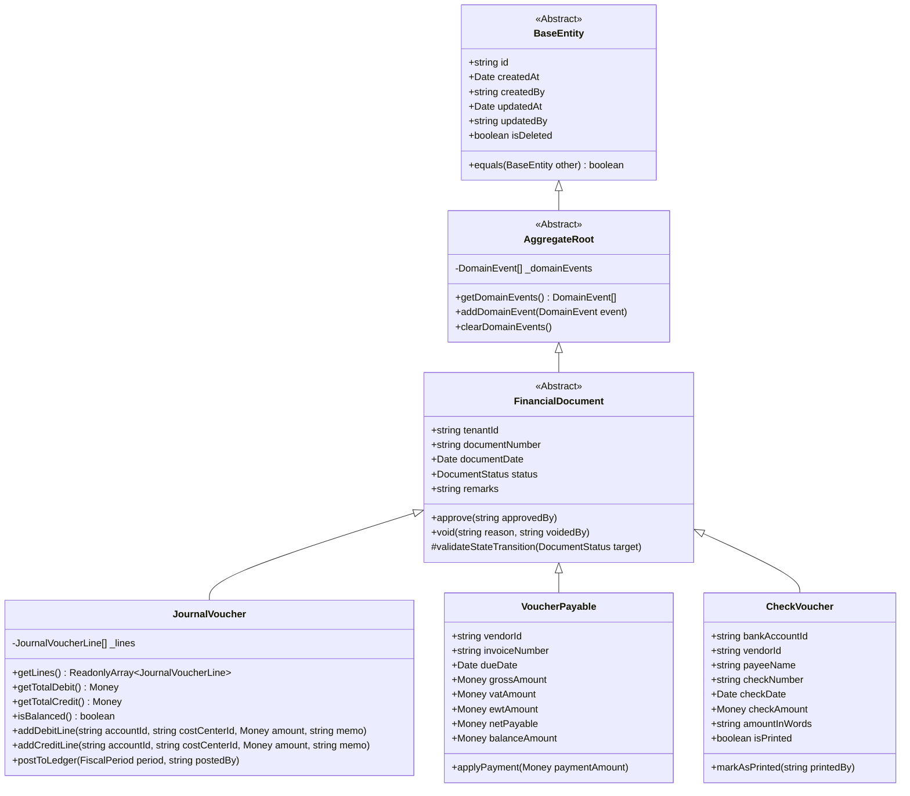
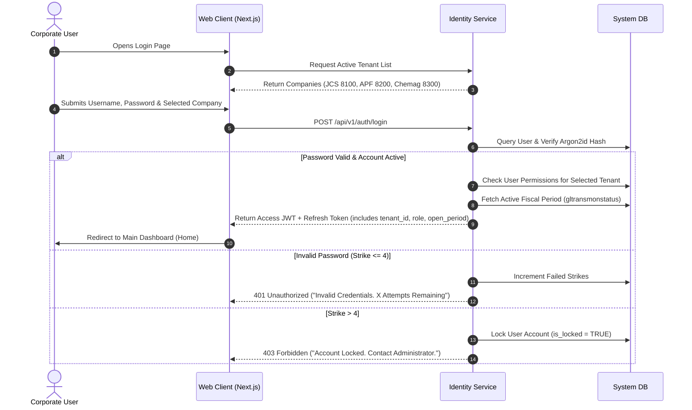
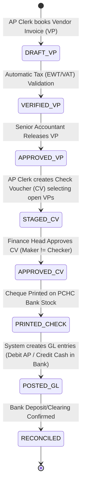
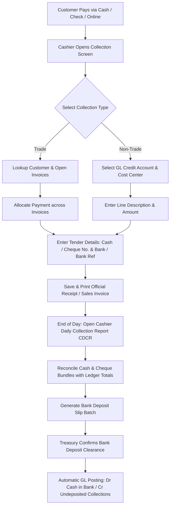
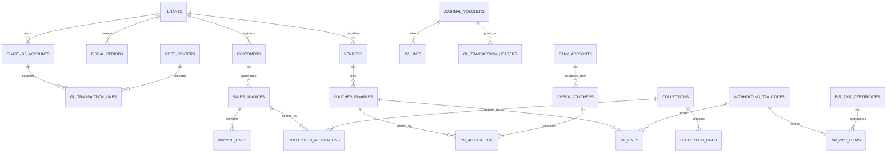

# AOS100 NextGen (JCS Co. Enterprise ERP Modernization)
## Comprehensive Master Product, Technical Architecture, Frontend Design & Engineering Blueprint

---

# Table of Contents
1. [Executive Summary & Document Control](#1-executive-summary--document-control)
2. [Complete Legacy Reference & System Baseline (From README.md)](#2-complete-legacy-reference--system-baseline-from-readmemd)
   - 2.1 [Legacy System Overview & Multi-Tenant Entities](#21-legacy-system-overview--multi-tenant-entities)
   - 2.2 [Legacy Technology Stack](#22-legacy-technology-stack)
   - 2.3 [Legacy Database Architecture & Multi-Tenant Routing](#23-legacy-database-architecture--multi-tenant-routing)
   - 2.4 [Legacy Key Database Tables Catalog](#24-legacy-key-database-tables-catalog)
   - 2.5 [Legacy File-System Storage & Config Files](#25-legacy-file-system-storage--config-files)
   - 2.6 [Legacy Application Flow & Navigation Architecture](#26-legacy-application-flow--navigation-architecture)
   - 2.7 [Legacy Module Walkthrough & Form Codes](#27-legacy-module-walkthrough--form-codes)
   - 2.8 [Legacy Deployment & Local Execution Runbook](#28-legacy-deployment--local-execution-runbook)
   - 2.9 [Legacy Directory & File Structure](#29-legacy-directory--file-structure)
   - 2.10 [Critical Legacy Technical Debt & Risk Analysis](#210-critical-legacy-technical-debt--risk-analysis)
3. [Document 1: Product Requirements Document (PRD)](#3-document-1-product-requirements-document-prd)
   - 3.1 [Product Vision & Business Drivers](#31-product-vision--business-drivers)
   - 3.2 [Target Audience & User Personas](#32-target-audience--user-personas)
   - 3.3 [Scope of Business Modules](#33-scope-of-business-modules)
   - 3.4 [Regulatory & Tax Compliance Specifications (BIR / EOPT / PCHC)](#34-regulatory--tax-compliance-specifications-bir--eopt--pchc)
   - 3.5 [Success Metrics & Non-Functional Requirements (NFRs)](#35-success-metrics--non-functional-requirements-nfrs)
4. [Document 2: Technical Design Document (TDD)](#4-document-2-technical-design-document-tdd)
   - 4.1 [Target System Architecture (Clean Architecture & Modular Monolith / CQRS)](#41-target-system-architecture-clean-architecture--modular-monolith--cqrs)
   - 4.2 [Recommended Modern Technology Stack](#42-recommended-modern-technology-stack)
   - 4.3 [Database Isolation & Schema Multi-Tenancy](#43-database-isolation--schema-multi-tenancy)
   - 4.4 [Security, Authentication & Cryptography](#44-security-authentication--cryptography)
   - 4.5 [Reporting & Cheque Printing Subsystem](#45-reporting--cheque-printing-subsystem)
   - 4.6 [Dockerization & Multi-Container Architecture](#46-dockerization--multi-container-architecture)
   - 4.7 [Object-Oriented Programming (OOP) & Domain-Driven Design (DDD) Specifications](#47-object-oriented-programming-oop--domain-driven-design-ddd-specifications)
   - 4.8 [Firebase Ready Deployment Architecture (Hosting & Cloud Run Integration)](#48-firebase-ready-deployment-architecture-hosting--cloud-run-integration)
5. [Document 3: Application Flow & Role-Based Journeys](#5-document-3-application-flow--role-based-journeys)
   - 5.1 [Unified Authentication & Tenant Switching Flow](#51-unified-authentication--tenant-switching-flow)
   - 5.2 [Role-Based Access Control (RBAC) & Segregation of Duties Matrix](#52-role-based-access-control-rbac--segregation-of-duties-matrix)
   - 5.3 [Core Operational User Journeys](#53-core-operational-user-journeys)
6. [Document 4: Frontend Design & UI/UX Architecture Specification](#6-document-4-frontend-design--uiux-architecture-specification)
   - 6.1 [Design System & Visual Identity ("FinTech Precision")](#61-design-system--visual-identity-fintech-precision)
   - 6.2 [Global Layout Architecture & Shell](#62-global-layout-architecture--shell)
   - 6.3 [Role-Based UI Dynamic Rendering](#63-role-based-ui-dynamic-rendering)
   - 6.4 [Key Screen UI Breakdowns](#64-key-screen-ui-breakdowns)
     - 6.4.1 [Executive Financial Dashboard](#641-executive-financial-dashboard)
     - 6.4.2 [Data-Heavy Tables (General Ledger & Virtualized Accounting Grids)](#642-data-heavy-tables-general-ledger--virtualized-accounting-grids)
     - 6.4.3 [Complex Multi-Step Forms (Voucher Creation & BIR Form 2307)](#643-complex-multi-step-forms-voucher-creation--bir-form-2307)
     - 6.4.4 [Print-Ready Views & Cheque Printing Alignment](#644-print-ready-views--cheque-printing-alignment)
   - 6.5 [Component Library & Tech Stack Strategy](#65-component-library--tech-stack-strategy)
   - 6.6 [State Management & Data Fetching Architecture](#66-state-management--data-fetching-architecture)
7. [Document 5: Backend Database Schema](#7-document-5-backend-database-schema)
   - 7.1 [Entity-Relationship Architecture](#71-entity-relationship-architecture)
   - 7.2 [Core Table Definitions & Data Types](#72-core-table-definitions--data-types)
   - 7.3 [Legacy Table to NextGen Relational Entity Mapping](#73-legacy-table-to-nextgen-relational-entity-mapping)
8. [Document 6: Engineering Plan & Phased Roadmap](#8-document-6-engineering-plan--phased-roadmap)
   - 8.1 [Sequential Sprint & Milestone Breakdown (Sprints 1 to 8)](#81-sequential-sprint--milestone-breakdown-sprints-1-to-8)
   - 8.2 [Detailed Sprint Task Matrix](#82-detailed-sprint-task-matrix)
   - 8.3 [Legacy Data Migration, Reconciliation & Cutover Strategy](#83-legacy-data-migration-reconciliation--cutover-strategy)

---

# 1. Executive Summary & Document Control

| Attribute | Details |
| :--- | :--- |
| **Project Designation** | AOS100 NextGen (JCS Co. Enterprise ERP Modernization) |
| **Predecessor System** | AOS100 Web (ASP.NET Web Forms, VB.NET, .NET Framework 4.6, MySQL 5.7, SAP Crystal Reports 13.0) |
| **Target Organizations** | **JCS Chemical Industries, Inc.** (BA 8100), **APF Corporation** (BA 8200), **Chemag Trading Corporation** (BA 8300) |
| **Document Purpose** | Comprehensive architectural, product, frontend UI/UX, and engineering specification merging all legacy documentation from `README.md` with the NextGen modernized system plan across the 6 foundational documents. |
| **Compliance Mandates** | Philippine Tax Code (TRAIN Law, CREATE Act, Ease of Paying Taxes Act - RA 11976), BIR CAS (Computerized Accounting System) Regulations (RMC 10-2020 / RR 9-2009), Philippine Data Privacy Act of 2012 (RA 10173), Philippine Clearing House Corporation (PCHC) Check Standards. |
| **Author** | Lead Software Architect, Product Lead & UI/UX Frontend Architect |
| **Target Delivery** | 16 Weeks (8 Two-Week Sprints) |

---

# 2. Complete Legacy Reference & System Baseline (From README.md)

This section incorporates and preserves all architectural, operational, and database documentation from the legacy `README.md` to serve as the baseline for modernization.

## 2.1 Legacy System Overview & Multi-Tenant Entities
* **Application Name**: AOS100 Web (Accounting Operations System)
* **Primary Business Scope**: Financial Accounting, General Ledger, Payables, Receivables, Cashiering, Materials Management, Human Resources & Payroll.
* **Target Entities**: Multi-tenant support across 3 primary business areas:
  * **8100**: JCS Chemical Industries, Inc.
  * **8200**: APF Corporation
  * **8300**: Chemag Trading Corporation

## 2.2 Legacy Technology Stack

| Layer | Component | Details (From README.md) |
| :--- | :--- | :--- |
| **Backend Framework** | Microsoft ASP.NET Web Forms | Target Framework: **.NET Framework 4.6** |
| **Programming Language** | Visual Basic .NET (`VB.NET`) | Code-behind files (`.aspx.vb`, `.vb`) |
| **Database Management** | MySQL Server | Port 3306 (InnoDB/MyISAM), accessed via `MySql.Data.MySqlClient` |
| **Reporting Engine** | SAP Crystal Reports | Version 13.0 (`CrystalDecisions.Web` / `.rpt` templates) |
| **Frontend & UI** | AdminLTE, Bootstrap CSS, CSS3, jQuery 3.5, SweetAlert2 | Responsive tables, modals, interactive trees |
| **UI Components** | ASP.NET AJAX Control Toolkit | `AjaxControlToolkit.dll` v19.1.0.0 |
| **Development Solution** | Visual Studio Solution | `AOS100webJCS.sln` |

## 2.3 Legacy Database Architecture & Multi-Tenant Routing
All transactional, operational, and masterfile data in the legacy system persists in a **MySQL** database server running on port `3306`. The system dynamically routes queries to separate physical MySQL databases based on the user's selected Business Area (BA) stored in session state (`Session("BA")`):

| Business Area (BA) | Entity Name | Database Name | Default Connection Host |
| :--- | :--- | :--- | :--- |
| **8100** | JCS Chemical Industries, Inc. | `jcs` | `127.0.0.1` (Local) |
| **8200** | APF Corporation | `apf` | `127.0.0.1` (Local) / `192.168.3.154` (Server) |
| **8300** | Chemag Trading Corporation | `chemag` | `127.0.0.1` (Local) |

### Legacy Database Credentials (from `AOS100web.dll.config`):
* **User**: `root`
* **Password**: `a1o0s0`
* **Port**: `3306`
* **Connection Pooling**: `true`

## 2.4 Legacy Key Database Tables Catalog

### 1. General Ledger & Fiscal Periods
* `glmaintranstbl`: Master general ledger transactions table.
* `gltranstbl`: Detailed general ledger transaction lines.
* `gljvhdrtbl`: Journal Voucher (JV) headers.
* `tempgljvdettbl`: Temporary table used during Journal Voucher entry and debit/credit balancing.
* `gltransmonstatus`: Accounting period controls; maintains status (`OPEN` / `CLOSE`) for each fiscal year and month.
* `acctcharttbl`: Chart of Accounts (COA) master definitions.
* `cctrnotbl`: Cost Center codes and descriptions.

### 2. Accounts Payable & Disbursements
* `exphdrtbl`: Expense / Voucher Payable (VP) headers.
* `expdettbl`: Line-item breakdown of voucher expenses and charge accounts.
* `tempexpdettbl`: Temporary expense staging table during creation.
* `venmasttbl`: Vendor masterfile (vendor terms, TIN, address, bank information).
* `cvhdrtbl` & `cvdettbl`: Check Voucher header and allocation details.
* `tempcvdettbl`: Temporary Check Voucher staging table.
* `banktbl`: Company bank accounts and checking account references.

### 3. Accounts Receivable & Cashiering
* `colhdrtbl`: Collection / Official Receipt (OR) headers.
* `coldettbl`: Collection lines (cash breakdown, cheque numbers, clearing banks).
* `custdmcmhdrtbl` & `custdmcmdettbl`: Customer Debit Memo and Credit Memo header and line records.
* `tempdmcmdetwebtbl`: Temporary staging table for debit/credit memo lines.
* `tempaging_or` / `tempaging`: Working tables for AR aging calculations.
* `cdcr` / `dsrnotbl`: Cashier's Daily Collection Report records.
* `custmasttbl`: Customer masterfile (credit limits, pricing tiers, payment terms).
* `custewttbl`: Customer creditable withholding tax certificates (Form 2307).

### 4. Inventory & Materials Management
* `mmasttbl`: Master materials and item definitions.
* `invhdrtbl` & `invdettbl`: Inventory receipt and transfer records.
* `isshdrtbl` & `issdettbl`: Material issuance headers and detail lines.
* `plnttbl`: Plant, factory, and warehouse master definitions.
* `pohdrtbl` & `podettbl`: Purchase Order headers and detail line items.
* `mmrrhdrtbl` & `mmrrdettbl`: Material Receiving Report headers and inspection lines.

### 5. Payroll & Human Resources
* `payemployeetbl`: Employee profile and basic wage data.
* `payearntbl`: Payroll earnings breakdown.
* `paydeducttbl`: Statutory deductions (SSS, PhilHealth, Pag-IBIG) and tax withholdings.

### 6. System Configuration & Security
* `batbl`: Business Area reference table (`8100`, `8200`, `8300`).
* `sys_userrecords`: User credentials, account lock state, and full names.
* `sys_usergrouprights`: Screen-by-screen role permissions (View, Edit, Insert, Delete, Release, Autosave).
* `translog`: Audit log recording transactions, document numbers, users, and timestamps.

## 2.5 Legacy File-System Storage & Config Files
In addition to MySQL, the legacy system relies on configuration files and file-based logs on disk:
* `HRIS100web/App_Data/Companies.ini`: Lists selectable corporate entities.
* `HRIS100web/App_Data/ServerAddresses.ini`: Network host IPs for remote branch connectivity.
* `HRIS100web/App_Data/MainStat.txt`: Maintenance flag (`No` for normal operations; any other string routes traffic to `Maintenance.aspx`).
* `HRIS100web/App_Data/SystemAdvisory.txt`: Top navigation announcement banner text.
* `HRIS100web/Reports/*.rpt`: Pre-compiled Crystal Reports files for printing cheque formats, collection registers, and financial statements.
* `HRIS100web/logs/` & `c:\updater\logs\`: Plaintext audit trail logging user activity, IPs, and unhandled exceptions.

## 2.6 Legacy Application Flow & Navigation Architecture

```
                 ┌─────────────────────────────┐
                 │       User Opens Browser    │
                 └──────────────┬──────────────┘
                                │
                                ▼
                 ┌─────────────────────────────┐
                 │          Login.aspx         │
                 │   - Select Company (BA)     │
                 │   - Enter User ID & Pass    │
                 │   - Choose Server or Local  │
                 └──────────────┬──────────────┘
                                │
             ┌──────────────────┴──────────────────┐
             ▼                                     ▼
   [Validation Failure]                   [Validation Success]
   - Invalid username / pass              - Verified against `sys_userrecords`
   - Strike count increments              - Locks after 5 attempts
   - Account locks if strike > 4          - Retrieves open fiscal period
                                            from `gltransmonstatus`
                                                   │
                                                   ▼
                                  ┌────────────────────────────────┐
                                  │           Home.aspx            │
                                  │   (AOS100_main.Master Frame)   │
                                  └────────────────┬───────────────┘
                                                   │
         ┌───────────────────┬─────────────────────┼────────────────────┬───────────────────┐
         ▼                   ▼                     ▼                    ▼                   ▼
┌─────────────────┐ ┌─────────────────┐ ┌───────────────────┐ ┌───────────────────┐ ┌─────────────────┐
│  Financial      │ │    Material     │ │      Sales &      │ │  Human Resource   │ │  Administrator  │
│  Accounting     │ │   Management    │ │   Distribution    │ │    & Payroll      │ │                 │
│  (FI.master)    │ │   (MM.master)   │ │ (SalesAndDist.aspx│ │   (HRIS.master)   │ │  (Admin.master) │
└────────┬────────┘ └─────────────────┘ └───────────────────┘ └───────────────────┘ └─────────────────┘
         │
         ▼
┌─────────────────────────────────────────────────────────────┐
│                 Permission Enforcement (RBAC)               │
│     `IsAllowed(UserGroup, FormCode, Action)` via MySQL      │
├─────────────────────────────────────────────────────────────┤
│  Action 1: View    │ Action 2: Edit    │ Action 3: Insert   │
│  Action 4: Delete  │ Action 5: Release │ Action 6: Autosave │
└──────────────────────────────┬──────────────────────────────┘
                                │
            ┌──────────────────┴──────────────────┐
            ▼                                     ▼
   [Permission Granted]                  [Permission Denied]
   Open target ASPX screen               Display SweetAlert modal:
   (e.g., JournalVoucher.aspx)           "Not Allowed to this Module!"
```

## 2.7 Legacy Module Walkthrough & Form Codes

### 1. Master Page & Top Navigation (`AOS100_main.Master`)
Displays logged-in company name, user profile, system announcement marquee, and top-level module links.

### 2. Financial Accounting Subsystem (`FI.master`)
Contains a tree-view menu with specialized modules and Form Codes:
* **General Ledger**:
  * `JournalVoucher.aspx` (`Form 052`): Journal Voucher creation, manual entries, debit/credit balancing.
  * `JVPosting.aspx`: Posting approved journal vouchers into the permanent General Ledger.
  * `JVedit.aspx`: Review and adjustment of auto-generated JV entries.
  * `AccountingPeriod.aspx`: Monthly and Year-end closing controls to protect closed periods.
  * `ChartOfAcct.aspx`: Chart of Accounts maintenance.
  * `GLReports.aspx`: General Ledger registers, trial balances, and subsidiary ledgers.
  * `FS.aspx` / `FSChemag.aspx`: Balance Sheet, Income Statement, and Retained Earnings reports.
* **Accounts Payable (AP)**:
  * `VoucherPayables.aspx` (`Form 023`): Booking vendor invoices and operating expenses.
  * `CheckVoucher.aspx` (`Form 024`): Preparation of Cheque Vouchers (CV), auto-printing physical cheques on custom printer stock, and generating check registers.
  * `Liquidation.aspx`: Processing Cash Advance (CA) liquidations.
  * `CashDisb.aspx`: Petty Cash Voucher (PCV) disbursements.
  * `APreports.aspx`: AP Aging schedules and vendor balances.
* **Cashiering & Accounts Receivable (AR)**:
  * `Collection.aspx` (`Form 010`): Cash and cheque collections, official receipts (OR) issuance, and invoice application.
  * `CDCR.aspx`: Cashier's Daily Collection Report.
  * `BankDep.aspx`: Bank deposit preparation and clearing.
  * `CustDMCM.aspx` (`Form 090`/`092`): Customer Debit Memo / Credit Memo issuance.
  * `CustEWT.aspx` (`Form 066`): Customer Expanded Withholding Tax (BIR Form 2307 compliance).
  * `ARreports.aspx`: Customer statement of accounts (SOA) and aging reports.
* **Controlling & Costing**:
  * `COSvsASP.aspx`: Cost of Sales (COS) vs. Average Selling Price (ASP) margin analysis.
  * `BudgetMonitor.aspx`: Cost center actual expenditure tracking against approved budgets.

### 3. Materials Management Subsystem (`MM.master`)
* `PO.aspx`: Purchase Order preparation and approval.
* `MMRR.aspx`: Material Receiving Reports.
* `DeliveryOrder.aspx`: Customer delivery tracking.
* `InventoryReports.aspx`: Stock cards, warehouse balances, and inventory valuation.

## 2.8 Legacy Deployment & Local Execution Runbook

### Prerequisites
1. **Operating System**: Windows 10, Windows 11, or Windows Server.
2. **Web Server**: Internet Information Services (IIS) or Visual Studio IIS Express.
3. **.NET Framework**: **.NET Framework 4.6** (or higher, e.g., 4.7.2 / 4.8) installed.
4. **Database**: **MySQL Server 5.7 or 8.0** running on port `3306`.
5. **Drivers & Dependencies**:
   * **MySQL Connector/NET** (installed or referenced in `bin`).
   * **SAP Crystal Reports runtime engine for .NET Framework 4.0** (v13.0.4000.0 or 13.0.3500.0).

### Execution Steps
1. **Restore `Web.config` File**:
   * Copy `HRIS100web\bin\AOS100web.dll.config` to `HRIS100web\Web.config`.
2. **Database Initialization**:
   * Ensure MySQL is running on `127.0.0.1:3306`.
   * Create target databases:
     ```sql
     CREATE DATABASE jcs;
     CREATE DATABASE apf;
     CREATE DATABASE chemag;
     ```
   * Import corresponding schema and data dumps.
   * If root password is not `a1o0s0`, update connection strings in `Web.config`:
     ```xml
     <connectionStrings>
       <add name="MyConnectionStringJCS"
            connectionString="Server=127.0.0.1;User=root;Password=YOUR_PASSWORD;Database=jcs;Pooling=true;"
            providerName="MySql.Data.MySqlClient" />
     </connectionStrings>
     ```
3. **Run Application**:
   * Open `AOS100webJCS.sln` in Visual Studio (2013 through 2022).
   * Set `HRIS100web/Login.aspx` as Start Page.
   * Press **F5** to start IIS Express at `http://localhost:[port]/Login.aspx`.

## 2.9 Legacy Directory & File Structure

```
JCS Co/
├── AOS100webJCS.sln          # Visual Studio Solution file
├── Performance1.psess        # VS performance profiling session
├── README.md                 # Legacy documentation
├── PLAN.md                   # NextGen Modernization Master Blueprint
│
├── Crystal Reports Backup Files/
│                             # Backup copies of Crystal Report files
│
└── HRIS100web/               # Main ASP.NET Web Application
    ├── Web.config            # Runtime configuration
    ├── Global.asax           # Global application lifecycle
    ├── AOS100_main.Master    # Global navigation master page
    │
    ├── FI.master             # Financial Accounting master page & TreeView
    ├── MM.master             # Materials Management master page
    ├── HRIS.master           # Human Resources master page
    ├── Admin.master          # System Administrator master page
    ├── MyMenu.master         # Favorites / User Custom master page
    │
    ├── Login.aspx            # User login & business area selector
    ├── Home.aspx             # Dashboard home screen
    ├── FinancialAccounting.aspx
    ├── MaterialManagement.aspx
    ├── Administrator.aspx
    │
    ├── App_Data/             # Flat file configurations
    │   ├── Companies.ini     # Company list (8100, 8200, 8300)
    │   ├── ServerAddresses.ini
    │   └── SystemAdvisory.txt# Marquee announcement text
    │
    ├── modules/              # Shared VB.NET business logic
    │   ├── MyDBFunctions.vb  # Database connection pooling & routines
    │   ├── UserPermissionService.vb # Role-based permissions checks
    │   └── AmtWords.vb       # Number-to-words generator for cheques
    │
    ├── Reports/              # SAP Crystal Reports templates (.rpt)
    │   ├── 8000_prtVPform.rpt       # Voucher Payable printable form
    │   ├── 8000_prtCheckReg.vb      # Cheque Register
    │   ├── 8000_rptGLtrans.rpt      # General Ledger transaction report
    │   ├── 8000_rptCDCRreg.rpt      # Daily Collection summary report
    │   └── MM_prtForm_Delivery.rpt  # Delivery receipt form
    │
    ├── bin/                  # Compiled binary assemblies
    │   ├── AOS100web.dll     # Main application binary
    │   ├── AOS100web.dll.config
    │   ├── AjaxControlToolkit.dll
    │   └── CrystalDecisions.*.dll
    │
    ├── adminlte/             # AdminLTE dashboard theme styles & scripts
    ├── css/                  # Custom stylesheets
    ├── cdn/                  # Vendor JavaScript (SweetAlert2, jQuery)
    └── logs/                 # Daily event & error logs
```

## 2.10 Critical Legacy Technical Debt & Risk Analysis
1. **Insecure Password Storage**: Passwords in `sys_userrecords` are stored in reversible Base64 format (`base64Decode()`). Any read access to the database compromises all user accounts.
2. **SQL Injection Vulnerabilities**: While modern services like `UserPermissionService` use parameterized queries, numerous `.aspx.vb` routines concatenate user input directly into dynamic SQL queries.
3. **Physical Temporary Tables Concurrency Hazards**: The legacy application writes user-specific temporary state into physical tables (`tempaging_or`, `tempcvdettbl`, `tempexpdettbl`, `tempgljvdettbl`) filtered by `user = 'username'`. Abrupt connection closures, network drops, or concurrent sessions create orphaned records, cross-user data leakage, and lock contention.
4. **Crystal Reports Obsolescence**: Version 13.0 (.NET 4.0 runtime) causes runtime crashes due to 32-bit/64-bit mismatches, cannot be containerized on modern Linux infrastructure, and prevents auto-scaling.

---

# 3. Document 1: Product Requirements Document (PRD)

## 3.1 Product Vision & Business Drivers
**AOS100 NextGen** is a modern, cloud-native, high-performance Enterprise Resource Planning and Financial Accounting Platform engineered for industrial chemical manufacturing, feed milling, and chemical distribution. It unifies operations across JCS Chemical Industries, Inc., APF Corporation, and Chemag Trading Corporation into a single secure platform with real-time multi-tenant financial governance, sub-second ledger posting, automated Philippine regulatory tax compliance, precision MICR cheque printing, and 3-way matching for materials management.

## 3.2 Target Audience & User Personas

| Persona | Key Responsibilities | Legacy Pain Points | NextGen Upgraded Capabilities |
| :--- | :--- | :--- | :--- |
| **CFO / Finance Director** | Corporate governance, board reporting, tax strategy across all 3 entities. | Disjointed databases, delayed month-end reports, manual consolidation. | Multi-tenant consolidated dashboard, real-time P&L by cost center, one-click intercompany eliminations. |
| **Senior Accountant** | Period closing, JV approvals, trial balance reconciliation, audit oversight. | Manual JV balancing checks, temporary table lockups, unposted entry risks. | Strict double-entry balance check ($DR = CR$), Maker-Checker workflows, automated closing entries, period locking. |
| **Accounts Payable Specialist** | Vendor invoice booking (VPs), supplier reconciliation, check voucher issuance. | Re-keying vendor TINs, manual check voucher staging, dot-matrix printer alignment errors. | 3-way PO-MMRR matching, vendor aging with credit terms, bank check layout calibration tool. |
| **Cashier / Treasury Officer** | Daily collections (OR/Invoices), CDCR, bank deposits, cheque clearing. | Manual tallying of cash vs. cheques, delayed reconciliation of PDCs. | Multi-tender collection screen, automated CDCR batching, PDC maturity calendar, automated bank deposit slips. |
| **Tax & Compliance Officer** | BIR withholding tax compliance, Form 2307 issuance, ATC code reporting. | Tedious manual computation of tax credits and manual preparation of BIR 2307. | Automated BIR 2307 PDF generation, ATC auto-tagging (WI158, WC158), SAWT data export, EOPT compliance. |
| **Materials Supervisor** | Purchase orders, material receiving (MMRR), stock cards, warehouse transfers. | Disconnect between warehouse receiving notes and accounting invoice matching. | Barcode/QR asset tracking, automated Cost of Sales (COS) calculations, minimum reorder alert triggers. |
| **IT Auditor / System Admin** | User provisioning, role permissions, access control audits, system configuration. | Hard to trace who modified records due to flat-file or basic string logging in `translog`. | Granular RBAC, SSO/MFA support, immutable audit trail with JSON before/after state diffs. |

## 3.3 Scope of Business Modules
1. **General Ledger & Governance**: Multi-entity Chart of Accounts, Cost Center accounting, Journal Voucher lifecycle, Fiscal Year and Monthly Period control (`OPEN`/`CLOSED`/`LOCKED`), automated closing entries.
2. **Accounts Payable & Disbursements**: Vendor Masterfile, Voucher Payables (VP / TC 20) with 12% Input VAT and EWT calculations, Check Vouchers (CV / TC 24), precision vector cheque printing, Petty Cash and Liquidations.
3. **Accounts Receivable, Cashiering & Collections**: Customer Masterfile, Collections (OR/Invoice / TC 60) across Cash/Cheque/Online tenders, Cashier's Daily Collection Report (CDCR), Bank Deposit Batching, Customer Debit/Credit Memos (TC 90/92), Customer Creditable Withholding Tax (BIR Form 2307 / TC 66).
4. **Materials Management & Costing**: Material Master (`mmasttbl`), Purchase Orders (PO), Material Receiving Reports (MMRR) with 3-Way Matching, Inventory Valuation (Moving Average / FIFO), Stock Cards, Cost of Sales (COS) vs. Average Selling Price (ASP) margin analysis.
5. **Financial Reporting & BI**: Real-time Trial Balance, Comparative Balance Sheet, Multi-Departmental Income Statement, AP/AR Aging Schedules, Official BIR Tax Registers.
6. **Human Resources & Philippine Payroll**: Employee Masterfile (`payemployeetbl`), Statutory Deductions (`paydeducttbl`: 2026 SSS MSC schedule, PhilHealth 2.5%, Pag-IBIG PhP 200), BIR TRAIN Law semi-monthly withholding tax on compensation, Semi-monthly payroll computation engine, Official Payslip generator, and automatic Check Voucher (`Form 024`) disbursement.
7. **System Governance, Data Management & Access Matrix**: Role-Based Access Control matrix (`sys_usergrouprights`), Live User management with lockout controls, multi-tenant corporate entity switcher, dynamic application branding, and one-click demo data loading / fresh ledger initialization.

## 3.4 Regulatory & Tax Compliance Specifications (BIR / EOPT / PCHC)
* **Ease of Paying Taxes (EOPT) Act (RA 11976)**: Primary substantiating document for VAT claiming on both goods and services is standardized to the **Sales Invoice**. Official Receipts are transitioned to supplemental collection proofs.
* **BIR Form 2307 (Certificate of Creditable Tax Withheld At Source)**: Direct generation matching the exact official BIR layout with automatic Alphanumeric Tax Code (ATC) assignment (e.g., WC158 for corporate services at 2%, WC160 for corporate goods at 1%, WI010 for professional fees).
* **PCHC Cheque Standards**: Precision alignment complying with Philippine Clearing House Corporation cheque clearing regulations (exact MICR line clearance, millimeter-accurate date, payee, numerical amount, and amount-in-words placement).

## 3.5 Success Metrics & Non-Functional Requirements (NFRs)
* **Response Time**: Sub-200ms API response time on 95% of queries.
* **Concurrency**: Zero data corruption under 200+ concurrent multi-tenant accounting sessions.
* **Reliability & Availability**: 99.9% uptime with automated database failover.
* **Data Integrity**: 100% ACID compliance with zero unposted out-of-balance entries.

---

# 4. Document 2: Technical Design Document (TDD)

## 4.1 Target System Architecture (Next.js 15 Full-Stack TypeScript + Clean Domain Architecture)

```
┌────────────────────────────────────────────────────────────────────────┐
│               FULL-STACK MODERN WEB APPLICATION ARCHITECTURE           │
│   Next.js 15 (React 19 + TypeScript) App Router + Server Actions / APIs│
│                                                                        │
│   ┌────────────────────────────────────────────────────────────────┐   │
│   │                    PRESENTATION LAYER (UI/UX)                  │   │
│   │  - FinTech Precision Design System (Dark Shell / Slate Canvas) │   │
│   │  - High-Density Accounting Tables (TanStack Table v8 Virtual)  │   │
│   │  - Rapid Keyboard Navigation Engine (Tab / F-Keys / Shortcuts) │   │
│   │  - Client State & Caching: TanStack Query v5 + Zustand         │   │
│   └───────────────────────────────┬────────────────────────────────┘   │
│                                   │ Typed Server Actions / API Routes  │
│                                   ▼                                    │
│   ┌────────────────────────────────────────────────────────────────┐   │
│   │              APPLICATION & SECURITY LAYER (TypeScript)         │   │
│   │  - JWT Bearer Authentication & Refresh Token Rotation          │   │
│   │  - Multi-Tenant Middleware (Header: X-Tenant-Id / JWT Claim: ba│   │
│   │  - Maker-Checker Document Approval Workflow Engine             │   │
│   │  - Zod Strict Schema Validation & Rate Limiting                │   │
│   └───────────────────────────────┬────────────────────────────────┘   │
│                                   │ Orchestrates Domain Aggregates     │
│                                   ▼                                    │
│   ┌────────────────────────────────────────────────────────────────┐   │
│   │          DOMAIN LAYER (Object-Oriented & DDD Core)             │   │
│   │  - Encapsulated Aggregates: JournalVoucher, VoucherPayable,    │   │
│   │    CheckVoucher, Collection (Guaranteed DR = CR Invariant)     │   │
│   │  - Value Objects: Money (Decimal, Zero-Float), TaxRate, TIN    │   │
│   │  - Tax Strategy Engine: BIR Form 2307 ATCs (WC158, WC160)      │   │
│   │  - Cheque Layout Engine: Millimeter Vector Offset Strategies   │   │
│   └───────────────────────────────┬────────────────────────────────┘   │
│                                   │ Repositories & Unit of Work        │
│                                   ▼                                    │
│   ┌────────────────────────────────────────────────────────────────┐   │
│   │              INFRASTRUCTURE & DATA PERSISTENCE LAYER           │   │
│   │  - PostgreSQL 16 Connection Pool with Schema-per-Tenant        │   │
│   │  - Redis 7 Distributed Lock & Session Cache                    │   │
│   │  - PDFKit / Vector PDF Generator for Cheques & BIR Form 2307   │   │
│   └───────────────────┬───────────────────────────────┬────────────┘   │
└───────────────────────┼───────────────────────────────┼────────────────┘
                        ▼                               ▼
    ┌───────────────────────────────────────┐ ┌──────────────────────────┐
    │       DATABASE TIER (PostgreSQL 16)   │ │  CACHE & QUEUE (Redis 7) │
    │ - Dedicated Schemas per Business Area │ │ - Idempotency Locks      │
    │   (tenant_8100, 8200, 8300, shared)   │ │ - Session Management     │
    │ - Row-Level Security (RLS) Policies   │ │ - Batch Queues           │
    └───────────────────────────────────────┘ └──────────────────────────┘
```

## 4.2 Modern Technology Stack (100% Retiring Visual Basic .NET)

> [!IMPORTANT]
> **Legacy Retirement Notice**: Visual Basic .NET (`VB.NET`), ASP.NET Web Forms (`.aspx`), and SAP Crystal Reports from the predecessor system are **100% obsolete and completely retired**. The new platform is built entirely as a unified, enterprise-grade **Full-Stack TypeScript** modern web application.

| Layer | Modern Choice | Rationale & Legacy Improvement |
| :--- | :--- | :--- |
| **Web Application Platform** | **Next.js 15 (React 19, TypeScript)** | Unified full-stack architecture combining high-performance server-side rendering, React Server Components, and optimized API Route handlers in end-to-end TypeScript. |
| **Domain Architecture** | **Object-Oriented Programming (OOP) & DDD** | Rich domain models encapsulating financial invariants ($DR = CR$), value objects for zero-float precision, and polymorphic tax/cheque strategy patterns. |
| **API & Server Actions** | **Next.js Route Handlers + Zod Validation** | Type-safe RPC-style and REST endpoints validating inputs at compile and run time, replacing fragile ASPX code-behind event models. |
| **Component System** | **Shadcn UI (Radix Primitives) + Tailwind CSS** | Unstyled headless primitives providing full accessibility (ARIA), customized for high-density enterprise accounting grids. |
| **Data Grids & Forms** | **TanStack Table v8 + React Hook Form + Zod** | Virtualized row rendering for 50,000+ general ledger lines; client-side type-safe validation before submission. |
| **Database Engine** | **PostgreSQL 16 LTS** | Robust ACID transactional guarantees, native JSONB for audit log snapshots, schema-based multi-tenancy, and advanced indexing. |
| **Database Access** | **TypeScript Connection Pool (pg / Kysely / Prisma)** | Native connection pooling with dynamic schema switching (`SET search_path TO tenant_8100, public;`). |
| **Cheque & Tax Reporting** | **Vector PDF Engine (PDFKit / React-PDF)** | Programmatic vector PDF generation with millimeter-accurate coordinate calibration, replacing outdated SAP Crystal Reports. |
| **Cache & Queue** | **Redis 7** | Prevents duplicate voucher submissions via distributed idempotency locks. |
| **Authentication & Security** | **Argon2id + JWT + HTTP-Only Secure Cookies** | Replaces Base64 plain decoding with cryptographically salted Argon2id password hashing and short-lived JWT access tokens. |
| **Containerization** | **Docker Multi-Stage (<120MB Alpine)** | Ultra-lightweight container with non-root security. |
| **Deployment Target** | **Firebase Hosting / App Hosting & Cloud Run** | Serverless edge delivery, zero infrastructure maintenance, automatic SSL, and global CDN. |

## 4.3 Database Isolation & Schema Multi-Tenancy
The multi-tenant architecture uses PostgreSQL schema separation:
* `shared_system`: Central tenant catalog (`tenants`), centralized users (`users`), roles, and global audit logs.
* `tenant_8100`: JCS Chemical Industries, Inc.
* `tenant_8200`: APF Corporation.
* `tenant_8300`: Chemag Trading Corporation.

Every API request resolves the target tenant from the JWT claim (`ba`) and sets the PostgreSQL session search path: `SET search_path TO tenant_8100, public;`.

## 4.4 Security, Authentication & Cryptography
* **Password Hashing**: Upgraded from Base64 to **Argon2id** (memory cost: 64MB, iterations: 3, parallelism: 4).
* **Account Lockout**: 5 failed login strikes trigger an automated account lock, requiring administrative unlock.
* **Encryption at Rest**: Sensitive data (bank account numbers, TINs) encrypted using AES-256-GCM.
* **Audit Trail**: Every database state change writes an immutable JSON before/after snapshot to `audit_logs`.

## 4.5 Reporting & Cheque Printing Subsystem
* QuestPDF generates vector PDFs directly from C# code.
* Configurable cheque layout templates store millimeter offsets (X/Y coordinates) for Payee, Date, Amount in figures, and Amount in words for each corporate bank account (BDO, BPI, Metrobank, Security Bank, Chinabank).

## 4.6 Dockerization & Multi-Container Architecture

To guarantee deterministic builds, rapid deployment, and environment parity across local development, staging, and production, AOS100 NextGen is fully containerized with a production-grade, multi-stage Next.js 15 Full-Stack Docker configuration and orchestration.

### 4.6.1 Full-Stack Web App Containerization (`Dockerfile`)
The Next.js 15 Full-Stack Application (serving the React 19 FinTech interface and TypeScript API route handlers/server actions) uses a 3-stage minimal Alpine build (<120MB image size):
* **Stage 1 (`deps`)**: `node:22-alpine` installs dependencies via `npm ci` with clean lockfile reproducibility.
* **Stage 2 (`builder`)**: Compiles Next.js with `output: 'standalone'` enabled in `next.config.js`.
* **Stage 3 (`runner`)**: Runs as a dedicated unprivileged user `nextjs` (UID 1001), copying only the `.next/standalone` directory, public assets, and `.next/static`. Sets `NODE_ENV=production` and container health checking.

```dockerfile
# Multi-Stage Dockerfile for Next.js 15 Full-Stack TypeScript ERP
FROM node:22-alpine AS deps
RUN apk add --no-cache libc6-compat
WORKDIR /app
COPY package.json package-lock.json ./
RUN npm ci

FROM node:22-alpine AS builder
WORKDIR /app
COPY --from=deps /app/node_modules ./node_modules
COPY . .
ENV NEXT_TELEMETRY_DISABLED=1
RUN npm run build

FROM node:22-alpine AS runner
WORKDIR /app
ENV NODE_ENV=production
ENV NEXT_TELEMETRY_DISABLED=1
RUN addgroup --system --gid 1001 nodejs && adduser --system --uid 1001 nextjs
COPY --from=builder /app/public ./public
COPY --from=builder --chown=nextjs:nodejs /app/.next/standalone ./
COPY --from=builder --chown=nextjs:nodejs /app/.next/static ./.next/static
USER nextjs
EXPOSE 3000
ENV PORT=3000
HEALTHCHECK --interval=20s --timeout=5s --start-period=15s --retries=3 \
  CMD wget --no-verbose --tries=1 --spider http://localhost:3000/api/healthz || exit 1
CMD ["node", "server.js"]
```

### 4.6.2 Docker Compose Local & Staging Orchestration (`docker-compose.yml`)
A single command (`docker-compose up -d`) bootstraps the entire enterprise environment with network isolation, persistent storage, and dependency health checks:

```yaml
version: '3.8'

services:
  # Database Service: PostgreSQL 16
  db:
    image: postgres:16-alpine
    container_name: aos100_postgres
    restart: unless-stopped
    environment:
      POSTGRES_USER: ${POSTGRES_USER:-aos_admin}
      POSTGRES_PASSWORD: ${POSTGRES_PASSWORD:-Aos100SecurePass!}
      POSTGRES_DB: ${POSTGRES_DB:-aos100_core}
    ports:
      - "5432:5432"
    volumes:
      - pgdata:/var/lib/postgresql/data
      - ./database/init:/docker-entrypoint-initdb.d
    networks:
      - aos100_network
    healthcheck:
      test: ["CMD-SHELL", "pg_isready -U ${POSTGRES_USER:-aos_admin} -d ${POSTGRES_DB:-aos100_core}"]
      interval: 10s
      timeout: 5s
      retries: 5

  # Cache & Lock Service: Redis 7
  redis:
    image: redis:7-alpine
    container_name: aos100_redis
    restart: unless-stopped
    command: redis-server --requirepass ${REDIS_PASSWORD:-RedisSecurePass!}
    ports:
      - "6379:6379"
    volumes:
      - redisdata:/data
    networks:
      - aos100_network
    healthcheck:
      test: ["CMD", "redis-cli", "-a", "${REDIS_PASSWORD:-RedisSecurePass!}", "ping"]
      interval: 10s
      timeout: 5s
      retries: 5

  # Full-Stack Web App: Next.js 15 App Router (Frontend + API Routes)
  web:
    build:
      context: .
      dockerfile: Dockerfile
    container_name: aos100_web
    restart: unless-stopped
    environment:
      NODE_ENV: production
      DATABASE_URL: postgresql://${POSTGRES_USER:-aos_admin}:${POSTGRES_PASSWORD:-Aos100SecurePass!}@db:5432/${POSTGRES_DB:-aos100_core}?sslmode=disable
      REDIS_URL: redis://:${REDIS_PASSWORD:-RedisSecurePass!}@redis:6379
      JWT_SECRET: ${JWT_SECRET:-SuperSecretKeyForAOS100NextGenJwtAuth2026!}
    ports:
      - "3000:3000"
    depends_on:
      db:
        condition: service_healthy
      redis:
        condition: service_healthy
    networks:
      - aos100_network

networks:
  aos100_network:
    driver: bridge

volumes:
  pgdata:
    driver: local
  redisdata:
    driver: local
```

---

## 4.7 Object-Oriented Programming (OOP) & Domain-Driven Design (DDD) Specifications

AOS100 NextGen strictly enforces Object-Oriented Programming (OOP) and Domain-Driven Design (DDD) principles directly in **TypeScript**. This completely replaces procedural legacy scripts with encapsulated financial domain models, zero-float precision value objects, and scalable polymorphism.

### 4.7.1 Core OOP Principles in TypeScript



#### 1. Encapsulation & Invariant Protection
* **Guaranteed Accounting Equilibrium**: The `JournalVoucher` aggregate root enforces the fundamental accounting equation ($\sum \text{Debits} = \sum \text{Credits}$) at the object boundary. Lines cannot be directly pushed into internal arrays; all mutations occur via `addDebitLine()` and `addCreditLine()`.
* **Zero-Float Financial Math via Value Objects**: Monetary figures are encapsulated within an immutable `Money` value object (`amount: number`, `currency: string`), maintaining exact 2-decimal rounding (`Math.round((cents + Number.EPSILON) * 100) / 100`). JavaScript floating-point arithmetic errors (`0.1 + 0.2 !== 0.3`) are strictly prevented.
* **Controlled Lifecycle Transitions**: State mutations (`Draft` $\rightarrow$ `Approved` $\rightarrow$ `Posted` $\rightarrow$ `Void`) are strictly governed by protected state-machine transition methods inside `FinancialDocument`.

#### 2. Abstraction & Interface-Driven Contracts
* Repositories and external services adhere to lean, focused TypeScript interfaces:
  * `IRepository<TAggregate, TId>`: Generic persistence abstraction.
  * `IUnitOfWork`: Coordinates atomic multi-aggregate database transactions.
  * `ITaxCalculationStrategy`: Abstracts BIR tax withholding computation rules.
  * `IChequeLayoutStrategy`: Abstracts bank-specific cheque printing coordinates.
  * `ITenantContext`: Provides tenant resolution decoupled from HTTP request context.

#### 3. Polymorphism & Design Patterns in TypeScript
* **Strategy Pattern for Philippine Tax Calculations**:
  ```typescript
  export interface ITaxCalculationStrategy {
    isApplicable(taxCode: string): boolean;
    calculateTax(baseAmount: Money): TaxCalculationResult;
  }

  // Concrete Strategies
  export class ExpandedWithholdingTaxStrategy implements ITaxCalculationStrategy { ... }
  export class ValueAddedTaxStrategy implements ITaxCalculationStrategy { ... }
  export class ZeroRatedVatStrategy implements ITaxCalculationStrategy { ... }
  ```
* **Strategy Pattern for Bank Cheque Printing**:
  Polymorphic coordinate positioning for bank check leaves ensures bank format changes never require altering the printing pipeline:
  * `BdoChequeLayoutStrategy`
  * `BpiChequeLayoutStrategy`
  * `MetrobankChequeLayoutStrategy`
  * `ChinabankChequeLayoutStrategy`
* **Factory Pattern for Document Creation**:
  `FinancialDocumentFactory` dynamically instantiates and populates document aggregates based on transaction codes (`TC 010`, `TC 023`, `TC 024`, `TC 052`), auto-assigning default accounting rules and document sequence numbers.

#### 4. SOLID Principles Compliance Matrix
| Principle | Architectural Manifestation in AOS100 NextGen |
| :--- | :--- |
| **Single Responsibility (SRP)** | Domain aggregates encapsulate financial invariants; Application services handle orchestration; API route handlers only handle HTTP transport and validation. |
| **Open / Closed (OCP)** | New withholding tax regulations (e.g. new BIR ATCs under CREATE/EOPT) or new bank check layouts are added by implementing new strategy classes without touching core voucher code. |
| **Liskov Substitution (LSP)** | All financial document subclasses (`JournalVoucher`, `VoucherPayable`, `CheckVoucher`) seamlessly substitute `FinancialDocument` in batch audit logging and permission pipelines. |
| **Interface Segregation (ISP)** | Clients depend on fine-grained contracts (`IAuditable`, `ITenantScoped`, `IApproachable`, `IPostable`) rather than monolithic interfaces. |
| **Dependency Inversion (DIP)** | Core Domain models depend on zero external database drivers or HTTP frameworks. Persistence adapters (`PostgresRepository`) implement domain interfaces. |

---

## 4.8 Firebase Ready Deployment Architecture (Hosting & Cloud Run / App Hosting)

AOS100 NextGen is engineered to be **Firebase-Ready**, allowing rapid, low-maintenance deployment leveraging Firebase and Google Cloud serverless infrastructure:

```
┌────────────────────────────────────────────────────────────────────────┐
│                   FIREBASE / GOOGLE CLOUD ARCHITECTURE                 │
│                                                                        │
│   Public Traffic: https://aos100-jcs.web.app (or custom domain)        │
│                                   │                                    │
│                                   ▼                                    │
│   ┌────────────────────────────────────────────────────────────────┐   │
│   │                    FIREBASE HOSTING CDN                        │   │
│   │   - Global Edge Caching & Automated SSL Termination            │   │
│   │   - Serves Next.js 15 Static Assets, Pages & Edge Routes       │   │
│   │   - Security Headers (CSP, HSTS, X-Frame-Options: DENY)        │   │
│   └───────────────┬────────────────────────────────┬───────────────┘   │
│                   │                                │                   │
│      Route: /api/**                                Route: /**          │
│      (Server Actions / Cloud Run Backend)          (Static / SSR)      │
│                   │                                │                   │
│                   ▼                                ▼                   │
│   ┌────────────────────────────────┐   ┌───────────────────────────┐   │
│   │    GOOGLE CLOUD RUN / FUNCTIONS│   │   NEXT.JS 15 CLIENT SPA   │   │
│   │   - Runs Dockerized Next.js 15 │   │  - Client-Side Navigation │   │
│   │   - Full-Stack App Container   │   │  - TanStack Table v8 Grids│   │
│   │   - Autoscaling (0 to N)       │   │  - Offline IndexedDB Sync │   │
│   │   - Region: asia-east1         │   │  - FinTech Precision UI   │   │
│   └───────────────┬────────────────┘   └───────────────────────────┘   │
│                   │                                                    │
│                   ▼                                                    │
│   ┌────────────────────────────────┐                                   │
│   │  MANAGED POSTGRESQL & REDIS    │                                   │
│   │  (Cloud SQL PostgreSQL 16 +   │                                   │
│   │   Memorystore Redis)           │                                   │
│   └────────────────────────────────┘                                   │
└────────────────────────────────────────────────────────────────────────┘
```

### 4.8.1 Firebase Hosting Single-Origin Gateway (`firebase.json`)
Configures Firebase Hosting rewrites to route requests dynamically to Cloud Run or serve the built application with optimized caching headers:

```json
{
  "hosting": {
    "public": ".next",
    "ignore": [
      "firebase.json",
      "**/.*",
      "**/node_modules/**"
    ],
    "rewrites": [
      {
        "source": "/api/**",
        "run": {
          "serviceId": "aos100-web",
          "region": "asia-east1"
        }
      },
      {
        "source": "**",
        "destination": "/index.html"
      }
    ],
    "headers": [
      {
        "source": "**",
        "headers": [
          { "key": "X-Content-Type-Options", "value": "nosniff" },
          { "key": "X-Frame-Options", "value": "DENY" },
          { "key": "X-XSS-Protection", "value": "1; mode=block" },
          { "key": "Referrer-Policy", "value": "strict-origin-when-cross-origin" }
        ]
      },
      {
        "source": "/_next/static/**",
        "headers": [
          { "key": "Cache-Control", "value": "public, max-age=31536000, immutable" }
        ]
      }
    ]
  },
  "emulators": {
    "hosting": {
      "port": 5000
    },
    "ui": {
      "enabled": true,
      "port": 4000
    }
  }
}
```

### 4.8.2 Project Configuration (`.firebaserc`)
```json
{
  "projects": {
    "default": "aos100-jcs",
    "staging": "aos100-jcs-staging",
    "production": "aos100-jcs-prod"
  }
}
```

### 4.8.3 Automated One-Click Firebase Deployment Workflow
Cross-platform deployment scripts (`scripts/deploy-firebase.ps1` and `scripts/deploy-firebase.sh`) automate the release pipeline:
1. **Container Build & Push**: Builds the Next.js 15 Full-Stack Docker image and pushes it to Google Artifact Registry (`gcr.io/aos100-jcs/aos100-web:latest`).
2. **Cloud Run Deployment**: Deploys the container to Cloud Run with auto-scaling (1 to 10 instances in `asia-east1`).
3. **Firebase Release**: Executes `firebase deploy --only hosting` to update edge CDN routing and headers.

---

# 5. Document 3: Application Flow & Role-Based Journeys

## 5.1 Unified Authentication & Tenant Switching Flow



## 5.2 Role-Based Access Control (RBAC) & Segregation of Duties Matrix

| System Function | AP Clerk | Cashier | Senior Accountant | Finance Head / CFO | System Admin |
| :--- | :---: | :---: | :---: | :---: | :---: |
| **Draft Voucher Payable (VP)** | ✅ Create | ❌ No | ✅ Create | ✅ Full | 👁️ View Only |
| **Approve / Release VP** | ❌ No | ❌ No | ✅ (If not creator) | ✅ Full | ❌ No |
| **Prepare Check Voucher (CV)** | ✅ Create | ❌ No | ✅ Create | ✅ Full | ❌ No |
| **Print Cheque** | ❌ No | ❌ No | ✅ Print | ✅ Full | ❌ No |
| **Issue Official Receipt (OR)**| ❌ No | ✅ Create | ❌ No | ✅ Full | 👁️ View Only |
| **Generate CDCR / Bank Deposit**| ❌ No | ✅ Create | ✅ Review | ✅ Full | ❌ No |
| **Issue BIR 2307 / CM Offset**| ❌ No | ❌ No | ✅ Create | ✅ Full | 👁️ View Only |
| **Post Journal Voucher to GL** | ❌ No | ❌ No | ❌ No | ✅ Release & Post | ❌ No |
| **Manage Fiscal Period Locks** | ❌ No | ❌ No | ❌ No | ✅ Close Period | ✅ Full Admin |
| **User & Role Administration** | ❌ No | ❌ No | ❌ No | 👁️ View Only | ✅ Full Admin |

## 5.3 Core Operational User Journeys

### Journey 1: Accounts Payable & Cheque Printing


### Journey 2: Cashiering, Official Receipting & CDCR Bank Deposit Flow


---

# 6. Document 4: Frontend Design & UI/UX Architecture Specification

## 6.1 Design System & Visual Identity ("FinTech Precision")

### 6.1.1 Aesthetic Philosophy
The visual identity of AOS100 NextGen is **FinTech Precision**: a purpose-built, high-density corporate aesthetic engineered for accounting, treasury, and inventory personnel who spend 8+ hours a day in data grids. It emphasizes high information density, strict tabular alignment, clear typographic hierarchy, and instant error detection.

### 6.1.2 Color Palette & Semantic Tokens

```css
:root {
  /* Surface & Background */
  --bg-app: #0B132B;              /* Dark Shell / Sidebar Background */
  --bg-surface: #1C2541;          /* Panel & Card Header Surface */
  --bg-page: #F8FAFC;             /* Light Mode Workspace Background (Slate 50) */
  --bg-card: #FFFFFF;             /* Data Grid / Card Canvas */
  --bg-card-alt: #F1F5F9;         /* Alternating Row Zebra Stripe (Slate 100) */
  --border-grid: #CBD5E1;         /* Crisp Table Borders (Slate 300) */
  --border-focus: #2563EB;        /* Accessible Keyboard Focus Ring */

  /* Brand & Interactive */
  --primary-600: #2563EB;         /* Corporate Blue (Action Buttons, Selected Rows) */
  --primary-700: #1D4ED8;         /* Primary Hover State */
  --primary-accent: #06B6D4;      /* Active Tab & Metric Accents (Cyan) */

  /* Semantic Financial Tokens */
  --financial-credit: #059669;    /* Credit Entries / Positive Cash / Balanced (Emerald 600) */
  --financial-credit-bg: #ECFDF5; /* Credit Badge Tint (Emerald 50) */
  --financial-debit: #DC2626;     /* Debit Entries / Unbalanced Warning / Void (Red 600) */
  --financial-debit-bg: #FEF2F2;  /* Debit Badge Tint (Red 50) */
  --financial-pending: #D97706;    /* Unapproved / Staged / Pending Release (Amber 600) */
  --financial-pending-bg: #FFFBEB;/* Pending Badge Tint (Amber 50) */

  /* Text Colors */
  --text-primary: #0F172A;        /* High-contrast Main Text (Slate 900) */
  --text-secondary: #475569;      /* Muted Labels & Descriptions (Slate 600) */
  --text-inverse: #FFFFFF;        /* Dark Shell Text */
}
```

### 6.1.3 Typography Best Suited for Data-Dense Financial Tables
* **Primary Interface Font**: `Inter`, `-apple-system`, `sans-serif` (font sizes: 11px to 14px). Clean, high legibility on standard displays.
* **Financial Numerical Data Font**: `JetBrains Mono` or `Roboto Mono` with strict OpenType configuration:
  ```css
  font-family: 'JetBrains Mono', monospace;
  font-variant-numeric: tabular-nums lining-nums;
  letter-spacing: -0.02em;
  ```
  *Why Tabular Figures are Required*: In standard fonts, the digit `1` is narrower than `8`, causing numbers in stacked rows to misalign. `tabular-nums` forces equal character widths across all digits `0` through `9`, guaranteeing that decimal points and comma separators line up vertically.
* **Alignment Rules**:
  * Text, Descriptions, Account Titles: Left-aligned (`text-left`).
  * Codes, Document Numbers, Dates, TINs: Centered (`text-center`).
  * Quantities, Unit Costs, Debit, Credit, Balances: Right-aligned (`text-right`).

### 6.1.4 Spacing, Border-Radius & Shadow Guidelines
* **Spacing Scale**: Ultra-compact 4px grid system (`p-1` = 4px, `p-2` = 8px, `p-3` = 12px, `p-4` = 16px). Table cells use `py-1.5 px-2.5` to maximize visible rows on 1080p monitors.
* **Border Radius**: Subdued, professional `rounded-sm` (2px) for table inputs and `rounded-md` (4px) for modals and action cards. Avoids playful, overly rounded buttons (`rounded-full`).
* **Shadows**: Subtle, low-diffusion shadows (`shadow-sm`: `0 1px 2px 0 rgb(0 0 0 / 0.05)`) to eliminate visual clutter.

---

## 6.2 Global Layout Architecture & Shell

The application shell consists of 4 primary regions:

```
┌────────────────────────────────────────────────────────────────────────┐
│ TOP NAVBAR: [Logo] [Company: JCS 8100 ▼] [Search F3] [Period: Open] [User ▼]│
├───────────────┬────────────────────────────────────────────────────────┤
│ SIDEBAR (240px│ BREADCRUMBS: Financial Accounting > General Ledger > JV│
│ Collapsible): │────────────────────────────────────────────────────────│
│               │                                                        │
│  [Search Menu]│                                                        │
│  ▼ Gen Ledger │                 PAGE CONTENT WORKSPACE                 │
│    - JV Entry │          (Data Grids, Multi-Step Forms, Charts)        │
│    - Posting  │                                                        │
│  ► Payables   │                                                        │
│  ► Cashiering │                                                        │
│  ► Tax (2307) │                                                        │
│  ► Materials  │                                                        │
│  ► Reports    │                                                        │
│               │                                                        │
│  [Collapse ◀] │                                                        │
├───────────────┴────────────────────────────────────────────────────────┤
│ STATUS BAR: [Tenant: 8100] [Host: 127.0.0.1] [Status: Ready] [F2 Save] │
└────────────────────────────────────────────────────────────────────────┘
```

1. **Top Navbar (Height: 52px)**:
   * **Company / Business Area Switcher**: Instant dropdown (`8100 JCS`, `8200 APF`, `8300 Chemag`). Displays active legal entity badge.
   * **Global Command Palette / Search (`F3` / `Cmd+K`)**: Instant lookup across Vouchers, Customers, Vendors, and Account codes.
   * **Fiscal Period Indicator**: Displays current open period (e.g., `Period: Sept 2026 [OPEN]`). Glows red if period is closed.
   * **User Profile & Notifications**: Displays logged-in role (`Senior Accountant`), branch assignment, and pending approval badge count.
2. **Collapsible Sidebar Navigation (Width: 240px expanded / 60px collapsed)**:
   * Accordion hierarchy grouping modules: General Ledger, Accounts Payable, Cashiering & AR, Withholding Taxes, Materials Management, Financial Statements, System Admin.
   * "My Favorites" pinned quick-links section matching legacy `MyFavorites.aspx`.
   * Hotkey indicator tags on common actions.
3. **Breadcrumb & Document Action Header**:
   * Hierarchical trail with instant back navigation.
   * Primary Action Toolbar: [F4 New], [F2 Save], [F7 Print], [F9 Release/Approve], [Void].
4. **Sticky Financial Status Bar (Height: 28px)**:
   * Displays active database connection, client IP, system clock, and hotkey legend.

---

## 6.3 Role-Based UI Dynamic Rendering

The UI shell dynamically mutates navigation items, action buttons, and form capabilities based on the user's role:

| UI Region / Feature | Cashier View | Accounts Payable Clerk | Senior Accountant | CFO / Finance Head |
| :--- | :--- | :--- | :--- | :--- |
| **Sidebar Navigation** | Cashiering (OR), CDCR, Bank Deposits, Customer Master. All other modules hidden. | Voucher Payables, Check Vouchers, Vendor Master, AP Reports. | General Ledger, Vouchers, Tax (2307), MMRR, Financial Reports. | Full executive visibility across all modules, company consolidation. |
| **Action Buttons on Vouchers** | No access to voucher screens. | [Save Draft], [Submit for Approval]. [Release] button is **hidden**. | [Save Draft], [Release/Approve] (enabled if creator $\neq$ user). | Full [Approve], [Post to GL], [Void], [Override Lock]. |
| **Cheque Print Button** | Hidden. | Hidden. | Enabled (only for approved Check Vouchers). | Enabled. |
| **Field Editability** | Read-only on invoices; editable tender inputs (Cash/Check details). | Line item expense editing allowed during Draft state. | Full adjustment rights on unposted entries. | Executive review and sign-off. |

---

## 6.4 Key Screen UI Breakdowns

### 6.4.1 Executive Financial Dashboard
* **High-Level KPI Metric Cards**:
  * **Cash & Bank Balance**: Aggregated real-time balance across all bank accounts (`1010-xxx`) with 7-day trend sparkline.
  * **Open Accounts Payable**: Total outstanding vendor liabilities broken down into Due Today, Overdue, and Current.
  * **Accounts Receivable Aging**: Total receivables with color-coded 30/60/90/120-day age distribution bar.
  * **Withholding Tax Due**: Month-to-date creditable and expanded withholding tax liabilities.
* **Pending Approvals Queue**: Tabbed table listing vouchers awaiting approval (Voucher Payables, Check Vouchers, Manual JVs). Includes direct "Review & Release" action trigger.
* **Cash Flow Inflow/Outflow Chart**: Interactive stacked bar chart comparing collections vs. disbursements over the past 12 weeks.

### 6.4.2 Data-Heavy Tables (General Ledger & Virtualized Accounting Grids)
* **Virtualization Strategy**: Implements **TanStack Table v8** paired with `@tanstack/react-virtual`. Only renders the 30 rows visible in the viewport, delivering 60 FPS scrolling across 50,000+ transaction lines.
* **Sticky Frozen Headers & Columns**:
  * The header row remains pinned at the top during vertical scroll.
  * The `Batch #` and `Transaction Date` columns freeze on the left during horizontal scroll.
  * Summary footer row (Total Debits, Total Credits) remains fixed at the bottom.
* **Multi-Column Sorting & Filtering**:
  * Click column header for ascending/descending sort; `Shift+Click` for secondary sort.
  * Filter row beneath headers supports text search, date ranges, and numeric threshold operators (`>`, `<`, `=`).
* **Inline Cell Editing & Rapid Keyboard Matrix**:
  * Double-click or press `Enter` on a grid cell to enter inline edit mode.
  * Press `Tab` to commit and advance to the next cell.
  * Press `Arrow Down` to jump to the same column on the line below.

### 6.4.3 Complex Multi-Step Forms (Voucher Creation & BIR Form 2307)
* **Layout Structure**: Master-Detail pattern with 3 distinct zones:
  1. **Document Header Card**: Document Number, Date, Business Area, Vendor/Customer Selector (Async Combobox), Terms, and Currency.
  2. **Nested Line Items Grid**:
     * Column breakdown: `Line #`, `Account Code & Title` (auto-complete), `Cost Center`, `Debit (₱)`, `Credit (₱)`, `Tax ATC Code`, `Line Memo`.
     * Dynamic row addition: Pressing `Enter` on the last cell automatically appends a new balanced line item.
  3. **Real-Time Balance & Tax Tally Footer**:
     ```
     Gross Amount: ₱ 112,000.00 | 12% Input VAT: ₱ 12,000.00 | 2% EWT (WC158): -₱ 2,000.00 | Net Payable: ₱ 110,000.00
     [Total Debit: ₱ 112,000.00]  [Total Credit: ₱ 112,000.00]  [Difference: ₱ 0.00 - BALANCED]
     ```
* **Validation & Error Handling**:
  * **Zod Schema Validation**: Evaluates form state on blur and on submit.
  * Inline validation markers highlight individual cells with errors (e.g., missing cost center for expense account).
  * The "Save & Post" button is disabled whenever `Difference != 0.00`.

### 6.4.4 Print-Ready Views & Cheque Printing Alignment
* **Pixel-Perfect Print Architecture**:
  * Custom CSS `@media print` stylesheets strip all sidebar, header, and web chrome elements.
  * Configures exact physical dimensions using CSS `@page`:
    ```css
    @page {
      size: 8.5in 11in; /* Standard Letter Cheque Voucher Sheet */
      margin: 0mm;
    }
    ```
* **Cheque Printing Coordinate Calibration Engine**:
  * Philippine bank cheques (BDO, BPI, Metrobank, Chinabank) are printed on physical bank check stock using continuous or sheet-fed printers.
  * The UI provides a visual calibration dialog where administrative users can adjust millimeter offsets:
    ```json
    {
      "bank_code": "BDO",
      "date_x_mm": 152.4,
      "date_y_mm": 12.7,
      "payee_x_mm": 25.4,
      "payee_y_mm": 22.8,
      "amount_figures_x_mm": 155.0,
      "amount_figures_y_mm": 22.8,
      "amount_words_x_mm": 20.0,
      "amount_words_y_mm": 30.5
    }
    ```
  * Preview renders a live SVG simulation overlaying actual check dimensions before sending to the printer.

---

## 6.5 Component Library & Tech Stack Strategy

### 6.5.1 Recommended Frontend Stack
* **Framework**: Next.js 15 (App Router, Server Actions, React 19).
* **Styling**: Tailwind CSS v3.4 + Tailwind Merge + CVA (Class Variance Authority).
* **Component Library**: **Shadcn UI** built on **Radix UI** primitives. Provides accessible, unstyled components that can be customized to dense accounting specifications without third-party design bloat.
* **Icons**: Lucide React.

### 6.5.2 Core Reusable UI Component Specifications
1. **`DataGrid<T>`**: High-performance virtualized table component with sticky headers, multi-sort, column filtering, export to Excel/CSV, and inline keyboard cell editing.
2. **`CurrencyInput`**: Precision numeric input automatically formatting thousand separators (`1,250,500.00`), restricting input to 2 decimal places, and supporting keyboard math shortcuts (`+100`, `*1.12`).
3. **`AsyncComboBox<T>`**: Searchable select input with virtualized dropdown list for selecting from 10,000+ accounts, customers, or items with zero UI lag.
4. **`FormDatePicker`**: Fiscal calendar date-picker restricting selections to the current open fiscal month (`gltransmonstatus`).
5. **`BalanceBadge`**: Pulsing visual indicator displaying whether debits equal credits.
6. **`PrintPreviewModal`**: Full-screen modal rendering vector PDF output with print/download controls.

---

## 6.6 State Management & Data Fetching Architecture

To maintain speed across high-volume ERP datasets, state is strictly partitioned into 3 tiers:

```
┌────────────────────────────────────────────────────────────────────────┐
│                        STATE MANAGEMENT TIERS                          │
├────────────────────────────────┬───────────────────────────────────────┤
│ 1. GLOBAL UI & SESSION STATE   │ Zustand Store                         │
│    - Active Tenant (8100/8200) │ Light, fast, persisted to localStorage│
│    - User Role & Permissions   │ No unnecessary re-renders             │
│    - Sidebar Collapse State    │                                       │
├────────────────────────────────┼───────────────────────────────────────┤
│ 2. COMPLEX FORM STATE          │ React Hook Form + Zod                 │
│    - Voucher Line Items Grid   │ Uncontrolled inputs with isolated     │
│    - Inline Debit/Credit Math  │ re-renders on cell blur               │
│    - Field-level Validations   │ Sub-millisecond typing response       │
├────────────────────────────────┼───────────────────────────────────────┤
│ 3. SERVER CACHE & DATA SYNC    │ TanStack Query v5 (React Query)       │
│    - General Ledger Lines      │ Stale-While-Revalidate caching        │
│    - Vendor/Customer Lookups   │ Automatic background invalidation     │
│    - Aging Reports             │ Optimistic updates on line deletes    │
└────────────────────────────────┴───────────────────────────────────────┘
```

* **Zero-Lag Form Performance**: `React Hook Form` uses uncontrolled inputs via refs. Entering figures in line item row 45 does not trigger a re-render of rows 1 through 44, preserving smooth 60 FPS typing.
* **Optimistic Offline Recovery**: Draft vouchers automatically persist to browser `IndexedDB` every 10 seconds. If a network disruption occurs, user work is preserved.

---

# 7. Document 5: Backend Database Schema

## 7.1 Entity-Relationship Architecture



## 7.2 Core Table Definitions & Data Types

### Table: `tenants` (Master Business Areas)
```sql
CREATE TABLE shared_system.tenants (
    id VARCHAR(10) PRIMARY KEY, -- '8100', '8200', '8300'
    company_name VARCHAR(150) NOT NULL,
    tin VARCHAR(20) NOT NULL,
    rdo_code VARCHAR(10) NOT NULL,
    address TEXT NOT NULL,
    is_active BOOLEAN DEFAULT TRUE,
    created_at TIMESTAMPTZ DEFAULT NOW()
);
```

### Table: `chart_of_accounts` (Replaces `acctcharttbl`)
```sql
CREATE TABLE chart_of_accounts (
    id UUID PRIMARY KEY DEFAULT gen_random_uuid(),
    tenant_id VARCHAR(10) NOT NULL REFERENCES shared_system.tenants(id),
    account_number VARCHAR(20) NOT NULL,
    account_name VARCHAR(150) NOT NULL,
    account_type VARCHAR(30) NOT NULL, -- 'ASSET', 'LIABILITY', 'EQUITY', 'REVENUE', 'EXPENSE', 'COS'
    parent_account_id UUID REFERENCES chart_of_accounts(id),
    normal_balance VARCHAR(2) NOT NULL, -- 'DR' or 'CR'
    is_active BOOLEAN DEFAULT TRUE,
    created_at TIMESTAMPTZ DEFAULT NOW(),
    CONSTRAINT uq_tenant_account UNIQUE (tenant_id, account_number)
);
CREATE INDEX idx_coa_tenant_acct ON chart_of_accounts(tenant_id, account_number);
```

### Table: `fiscal_periods` (Replaces `gltransmonstatus`)
```sql
CREATE TABLE fiscal_periods (
    id UUID PRIMARY KEY DEFAULT gen_random_uuid(),
    tenant_id VARCHAR(10) NOT NULL REFERENCES shared_system.tenants(id),
    fiscal_year INT NOT NULL,
    fiscal_month INT NOT NULL, -- 1 to 12
    date_from DATE NOT NULL,
    date_to DATE NOT NULL,
    status VARCHAR(10) NOT NULL DEFAULT 'OPEN', -- 'OPEN', 'CLOSED', 'LOCKED'
    closed_by UUID REFERENCES shared_system.users(id),
    closed_at TIMESTAMPTZ,
    CONSTRAINT uq_tenant_period UNIQUE (tenant_id, fiscal_year, fiscal_month)
);
```

### Table: `general_ledger_headers` & `general_ledger_lines` (Replaces `glmaintranstbl` & `gltranstbl`)
```sql
CREATE TABLE general_ledger_headers (
    id UUID PRIMARY KEY DEFAULT gen_random_uuid(),
    tenant_id VARCHAR(10) NOT NULL REFERENCES shared_system.tenants(id),
    batch_number VARCHAR(30) NOT NULL,
    source_module VARCHAR(10) NOT NULL, -- 'JV', 'VP', 'CV', 'OR', 'DM', 'CM', 'INV'
    source_doc_no VARCHAR(30) NOT NULL,
    transaction_date DATE NOT NULL,
    fiscal_period_id UUID NOT NULL REFERENCES fiscal_periods(id),
    total_debit NUMERIC(18,2) NOT NULL,
    total_credit NUMERIC(18,2) NOT NULL,
    status VARCHAR(15) NOT NULL DEFAULT 'POSTED', -- 'POSTED', 'VOID'
    created_by UUID NOT NULL REFERENCES shared_system.users(id),
    created_at TIMESTAMPTZ DEFAULT NOW(),
    CONSTRAINT uq_tenant_batch UNIQUE (tenant_id, batch_number),
    CONSTRAINT chk_balanced CHECK (total_debit = total_credit)
);

CREATE TABLE general_ledger_lines (
    id UUID PRIMARY KEY DEFAULT gen_random_uuid(),
    header_id UUID NOT NULL REFERENCES general_ledger_headers(id) ON DELETE CASCADE,
    line_number INT NOT NULL,
    account_id UUID NOT NULL REFERENCES chart_of_accounts(id),
    cost_center_id UUID REFERENCES cost_centers(id),
    debit_amount NUMERIC(18,2) NOT NULL DEFAULT 0.00,
    credit_amount NUMERIC(18,2) NOT NULL DEFAULT 0.00,
    line_description VARCHAR(255) NOT NULL,
    CONSTRAINT chk_positive_lines CHECK (debit_amount >= 0 AND credit_amount >= 0)
);
CREATE INDEX idx_gl_lines_header ON general_ledger_lines(header_id);
CREATE INDEX idx_gl_lines_account ON general_ledger_lines(account_id);
```

### Table: `voucher_payables` (Replaces `exphdrtbl` & `expdettbl`)
```sql
CREATE TABLE voucher_payables (
    id UUID PRIMARY KEY DEFAULT gen_random_uuid(),
    tenant_id VARCHAR(10) NOT NULL REFERENCES shared_system.tenants(id),
    vp_number VARCHAR(30) NOT NULL,
    vendor_id UUID NOT NULL REFERENCES vendors(id),
    invoice_number VARCHAR(50) NOT NULL,
    invoice_date DATE NOT NULL,
    due_date DATE NOT NULL,
    gross_amount NUMERIC(18,2) NOT NULL,
    vat_amount NUMERIC(18,2) NOT NULL DEFAULT 0.00,
    ewt_amount NUMERIC(18,2) NOT NULL DEFAULT 0.00,
    net_payable NUMERIC(18,2) NOT NULL,
    balance_amount NUMERIC(18,2) NOT NULL,
    status VARCHAR(15) NOT NULL DEFAULT 'DRAFT', -- 'DRAFT', 'APPROVED', 'PARTIAL', 'PAID', 'VOID'
    approved_by UUID REFERENCES shared_system.users(id),
    approved_at TIMESTAMPTZ,
    created_by UUID NOT NULL REFERENCES shared_system.users(id),
    created_at TIMESTAMPTZ DEFAULT NOW(),
    CONSTRAINT uq_tenant_vp UNIQUE (tenant_id, vp_number)
);
```

### Table: `check_vouchers` & `check_voucher_allocations` (Replaces `cvhdrtbl`, `cvdettbl`, and `tempcvdettbl`)
```sql
CREATE TABLE check_vouchers (
    id UUID PRIMARY KEY DEFAULT gen_random_uuid(),
    tenant_id VARCHAR(10) NOT NULL REFERENCES shared_system.tenants(id),
    cv_number VARCHAR(30) NOT NULL,
    bank_account_id UUID NOT NULL REFERENCES bank_accounts(id),
    vendor_id UUID NOT NULL REFERENCES vendors(id),
    payee_name VARCHAR(150) NOT NULL,
    check_number VARCHAR(30) NOT NULL,
    check_date DATE NOT NULL,
    check_amount NUMERIC(18,2) NOT NULL,
    amount_in_words VARCHAR(255) NOT NULL,
    status VARCHAR(15) NOT NULL DEFAULT 'PREPARED', -- 'PREPARED', 'APPROVED', 'PRINTED', 'CLEARED', 'VOID'
    is_printed BOOLEAN DEFAULT FALSE,
    created_by UUID NOT NULL REFERENCES shared_system.users(id),
    created_at TIMESTAMPTZ DEFAULT NOW(),
    CONSTRAINT uq_tenant_cv UNIQUE (tenant_id, cv_number)
);

CREATE TABLE check_voucher_allocations (
    id UUID PRIMARY KEY DEFAULT gen_random_uuid(),
    check_voucher_id UUID NOT NULL REFERENCES check_vouchers(id) ON DELETE CASCADE,
    voucher_payable_id UUID NOT NULL REFERENCES voucher_payables(id),
    applied_amount NUMERIC(18,2) NOT NULL,
    CONSTRAINT chk_positive_allocation CHECK (applied_amount > 0)
);
```

### Table: `bir_2307_certificates` & `withholding_tax_codes` (Replaces `custewttbl`)
```sql
CREATE TABLE withholding_tax_codes (
    id VARCHAR(10) PRIMARY KEY, -- 'WC158', 'WI158', 'WC160'
    tax_description VARCHAR(200) NOT NULL,
    tax_rate NUMERIC(5,4) NOT NULL, -- 0.0100, 0.0200
    tax_type VARCHAR(10) NOT NULL DEFAULT 'EWT', -- 'EWT', 'WVAT', 'FINAL'
    bir_form VARCHAR(10) NOT NULL DEFAULT '2307'
);

CREATE TABLE bir_2307_certificates (
    id UUID PRIMARY KEY DEFAULT gen_random_uuid(),
    tenant_id VARCHAR(10) NOT NULL REFERENCES shared_system.tenants(id),
    certificate_no VARCHAR(50) NOT NULL,
    customer_id UUID NOT NULL REFERENCES customers(id),
    period_from DATE NOT NULL,
    period_to DATE NOT NULL,
    total_tax_base NUMERIC(18,2) NOT NULL,
    total_withheld NUMERIC(18,2) NOT NULL,
    credit_memo_id UUID REFERENCES credit_memos(id),
    status VARCHAR(15) NOT NULL DEFAULT 'DRAFT', -- 'DRAFT', 'APPLIED', 'VOID'
    created_by UUID NOT NULL REFERENCES shared_system.users(id),
    created_at TIMESTAMPTZ DEFAULT NOW(),
    CONSTRAINT uq_tenant_2307 UNIQUE (tenant_id, certificate_no)
);
```

## 7.3 Legacy Table to NextGen Relational Entity Mapping

| Legacy MySQL Table | NextGen Relational Entity | Architectural Enhancement |
| :--- | :--- | :--- |
| `batbl` | `shared_system.tenants` | Dedicated schema separation, RDO code tracking, global multi-tenant resolution. |
| `sys_userrecords` | `shared_system.users` | Replaced Base64 passwords with Argon2id salted hashes; added MFA and lockout rules. |
| `sys_usergrouprights` | `shared_system.role_permissions` | Fine-grained Maker-Checker Segregation of Duties (SoD); dynamic HTTP verb mapping. |
| `acctcharttbl` | `chart_of_accounts` | 3NF normalized, hierarchical parent accounts, strict normal balance constraints (`DR`/`CR`). |
| `cctrnotbl` | `cost_centers` | Foreign-key linked to plant master and operating divisions. |
| `gltransmonstatus` | `fiscal_periods` | Replaced string statuses with strict date boundary checks and automated closing locks. |
| `glmaintranstbl` / `gltranstbl` | `general_ledger_headers` / `lines` | Database-level check constraint `CHECK (total_debit = total_credit)` prevents unposted entries. |
| `tempgljvdettbl` | **ELIMINATED** | Replaced by client-side form state (`React Hook Form`) and transactional staging APIs. |
| `exphdrtbl` / `expdettbl` | `voucher_payables` / `vp_lines` | Integrated Input VAT and EWT tracking; automated remaining balance deductions. |
| `tempexpdettbl` | **ELIMINATED** | Replaced by memory-managed draft state and Redis session staging. |
| `cvhdrtbl` / `cvdettbl` | `check_vouchers` / `allocations` | Eliminates race conditions; connects multiple VPs to a single cheque leaf. |
| `tempcvdettbl` | **ELIMINATED** | Fully removed. Relational allocation records prevent cross-user temporary table corruption. |
| `colhdrtbl` / `coldettbl` | `collections` / `collection_lines` | Multi-tender handling (Cash, Check, Online); automated allocation to Sales Invoices. |
| `tempaging_or` / `tempaging` | **ELIMINATED** | High-speed Dapper SQL stored procedures / dynamic queries calculate AR aging in memory. |
| `custewttbl` | `bir_2307_certificates` | Automated linkage to Credit Memos (`TC 90`) and quarterly BIR SAWT compliance exports. |
| `translog` | `shared_system.audit_logs` | Immutable audit trail capturing full JSON before/after snapshots for BIR CAS compliance. |

---

# 8. Document 6: Engineering Plan & Phased Roadmap

## 8.1 Sequential Sprint & Milestone Breakdown (Sprints 1 to 8)

The project is structured into **8 two-week sprints** spanning **16 weeks** across **4 enterprise milestones**:

```
┌────────────────────────────────────────────────────────────────────────┐
│ MILESTONE 1: Architecture, Multi-Tenant Engine & Identity (Month 1)    │
│ Sprint 1: Scaffolding, PostgreSQL Schemas & Argon2id Authentication   │
│ Sprint 2: Masterfiles (COA, Cost Centers, Vendors, Customers, Banks)   │
├────────────────────────────────────────────────────────────────────────┤
│ MILESTONE 2: Financial Core (GL, Payables & Cheque Printing) (Month 2) │
│ Sprint 3: General Ledger, Fiscal Periods, Journal Vouchers & Balancing │
│ Sprint 4: Accounts Payable (VP) & Precision Vector Cheque Engine       │
├────────────────────────────────────────────────────────────────────────┤
│ MILESTONE 3: Cashiering, BIR Form 2307 & Materials (Month 3)          │
│ Sprint 5: Cashier Collections (OR), CDCR Batching & Bank Deposits      │
│ Sprint 6: BIR Form 2307 Tax Engine, Credit Memos & Materials (MMRR)   │
├────────────────────────────────────────────────────────────────────────┤
│ MILESTONE 4: Financial Statements, Migration & Cutover (Month 4)       │
│ Sprint 7: Real-Time Financial Statements (BS, P&L, Aging) & Audit Logs │
│ Sprint 8: Legacy MySQL ETL Migration, 30-Day Parallel Run & Cutover    │
└────────────────────────────────────────────────────────────────────────┘
```

## 8.2 Detailed Sprint Task Matrix

### Sprint 1: Scaffolding, Multi-Tenant Database, OOP TypeScript Domain, Dockerization & Firebase Readiness
* **Task 1.1**: Initialize Next.js 15 Full-Stack Web Application with TypeScript, App Router, React 19, Tailwind CSS, Lucide icons, and Shadcn UI components.
* **Task 1.2**: Implement core Object-Oriented Programming (OOP) and DDD domain model hierarchy in TypeScript:
  * Abstract base classes: `BaseEntity`, `AggregateRoot`, `FinancialDocument`.
  * Value objects: `Money` (decimal + currency, zero-float precision), `TaxRate`, `TaxIdentificationNumber`.
  * Initial financial aggregates: `JournalVoucher` with encapsulated debit/credit equilibrium invariant ($DR = CR$), `VoucherPayable`, and `CheckVoucher`.
  * Core interfaces & abstractions: `IRepository<T>`, `IUnitOfWork`, `ITenantContext`, `ITaxCalculationStrategy`, `IChequeLayoutStrategy`.
* **Task 1.3**: Configure PostgreSQL 16 multi-tenant schemas (`shared_system`, `tenant_8100`, `tenant_8200`, `tenant_8300`) with dynamic search-path resolver and connection pooling.
* **Task 1.4**: Implement Argon2id password hashing, JWT bearer issuance, and session token rotation in Next.js Route Handlers.
* **Task 1.5**: Implement TypeScript OOP service client layer:
  * Abstract `BaseHttpService` managing JWT tokens, tenant header propagation (`X-Tenant-Id`), and error handling.
  * Concrete client services (`AuthApiService`, `VoucherApiService`, `TenantApiService`).
* **Task 1.6**: Multi-stage Dockerization setup:
  * Standalone production `Dockerfile` (<120MB Alpine image) with non-root `nextjs` user.
  * Root `docker-compose.yml` orchestrating PostgreSQL 16 Alpine, Redis 7 Alpine, and the Next.js Full-Stack Web App with healthchecks and persistent volumes.
* **Task 1.7**: Firebase Deployment Readiness:
  * Configure `firebase.json` with single-origin routing: `/api/**` rewritten to Cloud Run (`serviceId: aos100-web`, region: `asia-east1`) and `/**` served by Firebase Hosting.
  * Configure `.firebaserc` with project alias targets (`aos100-jcs`, `staging`, `production`).
  * Add cross-platform deployment automation scripts (`scripts/deploy-firebase.ps1` and `scripts/deploy-firebase.sh`).
* **Task 1.8**: Build Next.js Login interface with company switcher dropdown (`8100 JCS`, `8200 APF`, `8300 Chemag`) and 5-strike account lockout protection.
* **Task 1.9**: Build Executive Financial Dashboard overview with KPI metric cards, Cash Flow trends, and Journal Voucher entry module.

### Sprint 2: Masterfiles & Foundational Settings
* **Task 2.1**: Implement Chart of Accounts (COA) hierarchical CRUD API with prefix code validation.
* **Task 2.2**: Implement Cost Center (`cctrnotbl`) management with plant and division tags.
* **Task 2.3**: Build Vendor and Customer masterfile modules with TIN formatting, default ATC tax codes, and payment terms.
* **Task 2.4**: Create Bank Master module with checking account definitions and millimeter cheque coordinate settings.
* **Task 2.5**: Construct the reusable `DataGrid<T>` virtualized table component in Next.js using TanStack Table v8.

### Sprint 3: General Ledger & Fiscal Period Governance
* **Task 3.1**: Build Fiscal Period Controller (`gltransmonstatus`) with `OPEN`, `CLOSED`, and `LOCKED` status enforcement.
* **Task 3.2**: Implement Journal Voucher (JV / Form 052) module with strict client and server-side balance validation ($DR = CR$).
* **Task 3.3**: Build Maker-Checker review and approval workflow for Journal Vouchers.
* **Task 3.4**: Implement atomic GL Posting service that writes balanced entries to `general_ledger_headers` and `lines`.
* **Task 3.5**: Implement automated Month-End Closing and Year-End Retained Earnings adjustment routines.

### Sprint 4: Accounts Payable & Precision Cheque Printing
* **Task 4.1**: Build Voucher Payable (VP / Form 023) screen with automatic 12% Input VAT and EWT deductions.
* **Task 4.2**: Implement Check Voucher (CV / Form 024) module with multi-VP payment allocation grid (replacing `tempcvdettbl`).
* **Task 4.3**: Develop C# `AmtWords` currency verbalizer for Philippine Peso figures in words.
* **Task 4.4**: Build QuestPDF Vector Cheque Generator with millimeter-accurate positioning for BDO, BPI, Metrobank, and Security Bank.
* **Task 4.5**: Integrate browser-direct PDF print preview with keyboard hotkey trigger (`F7`).

### Sprint 5: Cashiering, Collections & Bank Deposits
* **Task 5.1**: Build Collection (OR / Form 010) module supporting Cash, Cheque, and Electronic Fund Transfers.
* **Task 5.2**: Implement multi-invoice payment allocation logic with automatic discount and withholding tax deductions.
* **Task 5.3**: Build Cashier's Daily Collection Report (CDCR) auto-aggregation module grouping collections by tender type.
* **Task 5.4**: Develop Bank Deposit preparation and clearing reconciliation module.
* **Task 5.5**: Implement Post-Dated Check (PDC) maturity tracking and alert banner.

### Sprint 6: BIR Form 2307 Tax Engine & Materials Management
* **Task 6.1**: Implement Alphanumeric Tax Code (ATC) catalog and automated calculation rules.
* **Task 6.2**: Build Customer EWT / BIR 2307 module with automated Credit Memo (TC 90) generation against open invoices.
* **Task 6.3**: Implement QuestPDF official BIR Form 2307 layout generator matching the official Philippine BIR design.
* **Task 6.4**: Build Material Receiving Report (MMRR) module with Purchase Order 3-way matching.
* **Task 6.5**: Implement Inventory Stock Card tracking and Moving Average costing engine.

### Sprint 7: Financial Statements & Compliance Auditing
* **Task 7.1**: Develop real-time Balance Sheet generation with comparative monthly and annual columns.
* **Task 7.2**: Develop Income Statement (P&L) generator broken down by Business Area and Cost Center.
* **Task 7.3**: Implement Accounts Payable and Accounts Receivable Aging Reports (Current, 30, 60, 90, 120+ days).
* **Task 7.4**: Implement automated immutable Audit Trail with JSON before/after state diff recording.
* **Task 7.5**: Build Cost of Sales (COS) vs. Average Selling Price (ASP) margin analysis screen.

### Sprint 8: Legacy Data Migration, Reconciliation & Cutover
* **Task 8.1**: Write migration ETL scripts extracting historical data from legacy MySQL databases (`jcs`, `apf`, `chemag`).
* **Task 8.2**: Clean and transform legacy Base64 credentials into temporary secure reset tokens.
* **Task 8.3**: Reconcile beginning GL account balances and unposted open VPs / AR invoices.
* **Task 8.4**: Execute 30-day side-by-side parallel run testing between legacy AOS100 and NextGen.
* **Task 8.5**: Final production cutover, DNS transition, and legacy system decommissioning.

## 8.3 Legacy Data Migration, Reconciliation & Cutover Strategy

```
┌─────────────────────────────────┐
│ Legacy MySQL Databases          │
│ (jcs, apf, chemag)              │
└────────────────┬────────────────┘
                 │
                 ▼
┌─────────────────────────────────┐
│ ETL Extraction & Sanitization   │
│ - Validate Account Codes        │
│ - Verify DR == CR on Historical │
│ - Strip Corrupt Strings & Invalids
└────────────────┬────────────────┘
                 │
                 ▼
┌─────────────────────────────────┐
│ Intermediate Staging DB         │
│ - Map Legacy Form Codes to RBAC │
│ - Transform Base64 to Argon2id  │
│ - Calculate Opening GL Balances │
└────────────────┬────────────────┘
                 │
                 ▼
┌─────────────────────────────────┐
│ Target PostgreSQL 16 Production │
│ (tenant_8100, 8200, 8300)       │
└─────────────────────────────────┘
```

1. **Extraction**: Automated Python/C# scripts extract historical masterfiles (`acctcharttbl`, `venmasttbl`, `custmasttbl`, `cctrnotbl`) and open transactions.
2. **Reconciliation Gate**:
   * Trial Balance in legacy system as of Cutover Date **MUST EQUAL** Trial Balance in NextGen to the exact centavo (₱ 0.00 difference).
   * Total open Accounts Payable balance **MUST EQUAL** open vendor balances.
   * Total open Accounts Receivable balance **MUST EQUAL** open customer invoices.
3. **Parallel Run Phase (30 Days)**: Both systems run concurrently. Cashiers and accountants input transactions in both systems; daily CDCR and trial balance outputs are cross-verified nightly.
4. **Sign-off & Cutover**: The CFO and Senior Accountant approve final cutover, after which legacy IIS web servers are switched to read-only archival mode.
