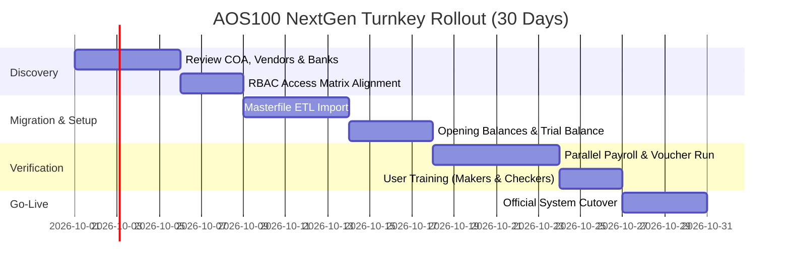

# AOS100 NextGen — Executive Client Presentation
## *The Modern Multi-Entity Financial Governance, Statutory Tax & Payroll ERP Platform*

> **Live Production System:** [https://jcs-co-web.vercel.app](https://jcs-co-web.vercel.app)  
> **Target Audience:** Board of Directors, Chief Executive Officer (CEO), Chief Financial Officer (CFO), Vice President of Finance, Head of IT, Chief Operating Officer (COO)  
> **Prepared For:** JCS Chemical Industries, APF Corp., Chemag Trading & Sister Group Enterprises

---

## 1. Executive Summary: Why AOS100 NextGen?

In today's fast-moving business landscape, running multiple corporate entities on disconnected legacy systems or fragile Excel sheets is **the single greatest operational risk** facing Philippine mid-market and enterprise groups.

### The Problem Today:
- **Audit Penalties & BIR Exposure:** Complex withholding taxes (BIR Form 2307, 1%, 2%, 5% EWT), expanded VAT, and constant statutory shifts (TRAIN, CREATE, EOPT) lead to costly BIR deficiency assessments when formulas break in spreadsheets.
- **2026 Statutory Payroll Compliance Headaches:** Constant updates to SSS brackets & Mandatory Provident Fund (WISP), PhilHealth's 5.0% rate (2.5% employee share), Pag-IBIG PhP 200 monthly ceilings, and progressive withholding tax schedules cost HR dozens of manual hours every cycle.
- **The "Multi-Entity Trap":** Managing sister companies (e.g., Chemical Manufacturing, Holding/Property, and Trading) requires logging in and out of different software databases, consolidating intercompany balances manually, and risking data leakages.
- **Expensive Foreign ERP Monopolies:** Traditional enterprise ERPs (SAP Business One, Oracle NetSuite, Microsoft Dynamics 365) demand **PhP 3,000,000 to PhP 8,000,000+** in upfront implementation fees, bill in volatile US Dollars, require 9 to 18 months of painful deployment, and still require third-party customizations just to print a Philippine BIR 2307 certificate or local bank cheque.

### The Solution:
**AOS100 NextGen** is a 100% turnkey, cloud-native Financial Governance & Operations ERP engineered specifically for Philippine multi-corporate enterprises. It unites **General Ledger, Accounts Payable, Cheque Printing, Cashiering, Materials 3-Way Match, Dedicated HRIS, and 2026 Statutory Payroll** into a single, high-performance platform accessible from any laptop, tablet, or smartphone.

---

## 2. The 5 Transformational Advantages

```
+-----------------------------------------------------------------------------------------+
|                                    AOS100 NEXTGEN                                       |
|                                                                                         |
|  [ 1. Multi-Tenant Group ]   [ 2. 100% BIR & 2026 CAS ]   [ 3. Maker-Checker Controls ] |
|  Switch entities in 0 sec    Automated 2307 & EWT         Audit-proof Segregation of    |
|  with strict isolation       tax computation              Duties & live approval trails |
|                                                                                         |
|  [ 4. Automated 2026 Payroll ]                 [ 5. Executive Mobile Terminal ]         |
|  SSS WISP, PhilHealth 2.5%,                    Full CEO/CFO approval power on phone     |
|  Pag-IBIG & English word payslips              via responsive PWA & quick navigation    |
+-----------------------------------------------------------------------------------------+
```

### 1. Zero-Flicker Multi-Entity Consolidation
- Manage multiple Business Areas (e.g., **8100: JCS Chemical Industries**, **8200: APF Corporation**, **8300: Chemag Trading**) within one interface.
- Change corporate entity instantly with **zero hard reloads** while guaranteeing 100% database and tenant isolation.

### 2. Strict Segregation of Duties (SoD) & Internal Fraud Prevention
- Built-in **Maker-Checker** dual authorization: A Voucher Maker (Accountant) can prepare vouchers and entries, but **only** the designated Finance Head or Approver can authorize disbursements and release cheques.
- Every create, edit, approve, and post action is stamped into an **immutable, tamper-evident audit trail** satisfying internal risk officers and external auditors (SGV, PWC, KPMG, Deloitte).

### 3. Built-In 2026 Philippine Tax & Regulatory Compliance
- **BIR Form 2307:** Automatically computes 1% (goods) and 2% (services) Expanded Withholding Tax (EWT), generating official BIR 2307 certificates with exact quarterly breakdown at the touch of a button.
- **TRAIN / CREATE / EOPT:** Real-time general ledger compliance with electronic journal voucher (Form 052) and accounts payable voucher (Form 023) standards.

### 4. Precision 2026 Payroll & HRIS Separation
- **Dedicated HRIS (201 Directory):** Centralized employee files, department trees, emergency contacts, leave balances, and leave approval workflows.
- **Automated Payroll Engine:** Evaluates semi-monthly gross, overtime, tardiness, 2026 SSS (including mandatory WISP tranche), PhilHealth (2.5% employee share), Pag-IBIG (PhP 200 ceiling), and TRAIN progressive withholding tax.
- **Legal-Standard Payslip Output:** Converts net pay into formatted English words (*"Forty-Four Thousand Nine Hundred Fifty-One Pesos & 50/100"*) for bank compliance and disputes prevention.

### 5. Cloud-Ready & Mobile-Optimized Executive Terminal
- No clunky remote desktops or VPNs required.
- Executives, Controllers, and Managers can review vouchers, check bank balances, approve leaves, and view real-time balance sheets directly from their mobile phones via the **Terminal Navigation & Tools** drawer.

---

## 3. Live Client Demonstration Script (10-Minute Pitch Walkthrough)

When presenting the live app to the client at **[https://jcs-co-web.vercel.app](https://jcs-co-web.vercel.app)**, follow this structured script:

### Step 1: Login & Theme Harmonization (1 Minute)
1. Open [https://jcs-co-web.vercel.app](https://jcs-co-web.vercel.app).
2. **Point out:** Modern dark mode default, zero visual jarring, and active System Advisory indicator showing fiscal period compliance.
3. Click any **Live System Account** (e.g., *Administrator* or *Sr. Accountant*) to show instant 1-click verification.

### Step 2: Instant Multi-Entity Switching (2 Minutes)
1. In the top bar, click the **Corporate Entity** dropdown.
2. Switch from **8100 — JCS Chemical Industries** to **8200 — APF Corporation**, then to **8300 — Chemag Trading**.
3. **Show the client:** Notice how the company data, chart of accounts, and financial metrics adapt instantly **without any page reloading or screen flickering**.

### Step 3: Maker-Checker Governance & Vouchers (2 Minutes)
1. Navigate to **General Ledger > Journal Vouchers**.
2. Show a pending voucher (e.g., JV for raw material purchase or accrual).
3. Demonstrate the dual-control state: *"Notice that Maker accounts cannot post this entry. The system requires an authorized Finance Head approval, eliminating rogue disbursements."*
4. Show **Vouchers Payable (Form 023)** and **Check Vouchers & Cheque Printing** with automatic amount-in-words spelling.

### Step 4: 1-Click Tax & Financial Intelligence (2 Minutes)
1. Navigate to **Reports > BIR Form 2307**.
2. Show the client the pre-calculated EWT schedule with Vendor TIN, Address, and tax withholdings already formatted for filing.
3. Navigate to **Reports > Financial Statements** to display the real-time Balance Sheet and Income Statement (P&L).

### Step 5: Dedicated HRIS & 2026 Payroll Engine (2 Minutes)
1. Open **Human Resources (HRIS)**: Walk through the 201 employee records, active department hierarchy, and leave approval center.
2. Open **Payroll & Compensation**: Click **"Process Semi-Monthly Payroll (Sep 1-15, 2026)"**.
3. **Highlight:** SSS, PhilHealth 2026, Pag-IBIG, and WTax calculated to the exact centavo. Click **"View Payslip"** to display the printed slip with formatted text amount words and bank batch disbursement export.

### Step 6: The Mobile Experience — "Enterprise in Your Pocket" (1 Minute)
1. Emulate or show the mobile view on a phone.
2. Point out the quick footer bar: **Home**, **Vouchers**, **Reports**, and **More**.
3. Tap **More**: Show the sleek **Terminal Navigation & Tools** modal sheet with categorized tiles matching modern financial terminals.

---

## 4. Financial ROI & Cost Comparison

How AOS100 NextGen compares directly against traditional alternatives:

| Evaluation Metric | SAP Business One / NetSuite | Disconnected Spreadsheets | AOS100 NextGen |
| :--- | :---: | :---: | :---: |
| **Initial Implementation Cost** | PhP 3.5M – 8.0M+ | PhP 0 (Hidden costs high) | **70%–80% Lower Initial Cost** |
| **Recurring Licensing** | $120–$250 USD / user / mo | None | **Predictable Peso Pricing** |
| **Deployment Lead Time** | 9 to 18 Months | None | **2 to 4 Weeks Turnkey** |
| **Philippine Tax Compliance (2307, EWT)** | Requires expensive custom add-on | Manual, high error risk | **Built-in & Automated** |
| **2026 Statutory Payroll (SSS, PhilHealth, Pag-IBIG)** | Separate module ($$$) | Error-prone manual formulas | **Fully Integrated Out-of-the-Box** |
| **Multi-Entity Group Support** | Additional database license per entity | Disconnected chaos | **Native Multi-Tenant Architecture** |
| **Hardware / Server Costs** | On-premise server / IT maintenance | None | **Zero Server Overhead (Cloud Native)** |
| **User Experience & Ease of Use** | Outdated, complex, steep training | Free-for-all | **Modern, Intuitive, Zero-Training UI** |

---

## 5. Implementation Roadmap & Cutover Plan

We follow a rapid, risk-free 30-day implementation methodology:



1. **Week 1 (Discovery & Configuration):** Chart of accounts synchronization, bank accounts setup, and user role assignments.
2. **Week 2 (Data Migration):** Clean ETL import of existing customer, vendor, and employee 201 files.
3. **Week 3 (Parallel Dry Run):** Execute one parallel payroll run and journal voucher cycle alongside existing processes.
4. **Week 4 (Go-Live & Support):** Handover, administrator sign-off, and continuous hypercare support.

---

## 6. Recommended Commercial Packages

### Package A: Enterprise Group Cloud (Recommended for Holding Groups)
- **Multi-Tenant Entities:** Unlimited Sister Companies (JCS Chemical, APF Corp, Chemag + future entities)
- **Modules Included:** General Ledger, Vouchers Payable, Cheque Printing, Cashiering, Materials MRR, Complete HRIS & 2026 Payroll, BIR 2307 Tax Reports, Aging Analytics.
- **Hosting & Backups:** Fully managed high-availability cloud deployment with automated daily backups and SSL.
- **SLA & Support:** Priority technical assistance, BIR statutory update patches, and dedicated onboarding consultant.

### Package B: Perpetual On-Premise License
- For groups requiring deployment within private enterprise VPC or on-premise infrastructure.
- Complete containerized Docker stack with PostgreSQL 16 database and Redis caching engine.

---

## 7. The Closing Ask: Next Steps

> *"Your financial data is the nervous system of your business. Every day spent on manual spreadsheets or outdated systems increases the risk of an unforced error, a delayed report, or a costly BIR audit penalty.*
>
> *Let us configure a **14-day Risk-Free Pilot** with your live Chart of Accounts and run a parallel payroll test for your team. Experience firsthand how AOS100 NextGen gives your leadership complete financial command."*

### Contact & Next Action:
- **Product Demonstration Link:** [https://jcs-co-web.vercel.app](https://jcs-co-web.vercel.app)  
- **Schedule Working Session:** Schedule a 30-minute discovery call to align masterfiles and authorize the pilot rollout.
